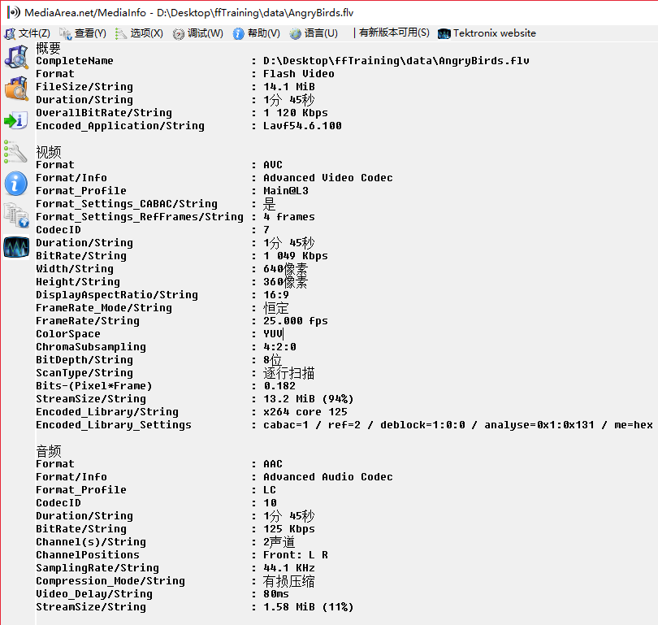
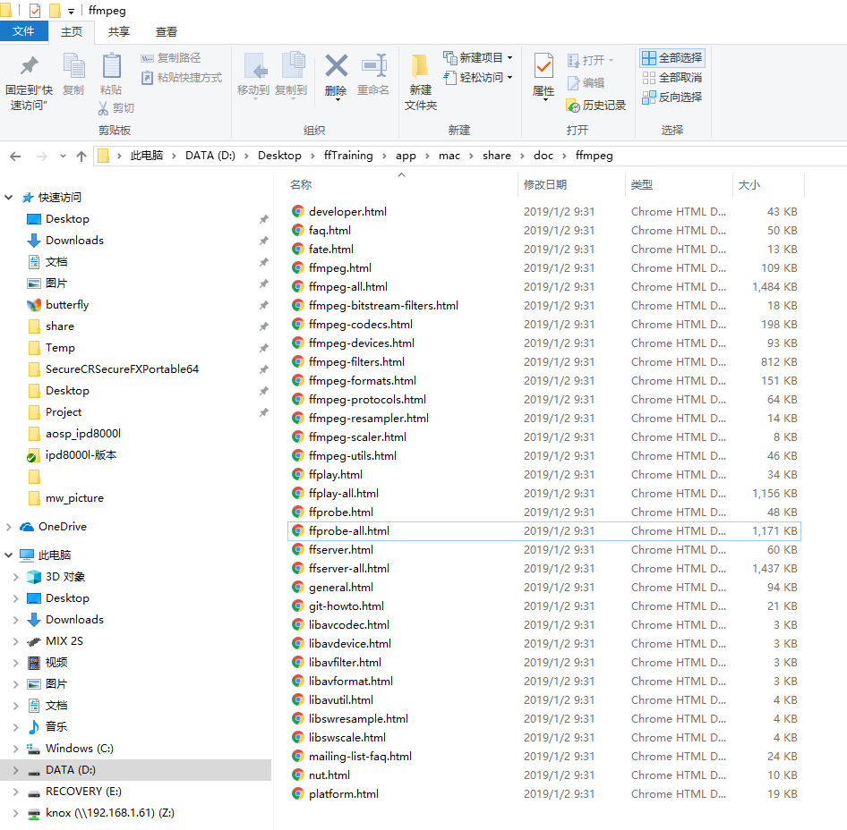
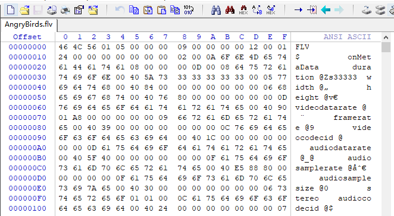
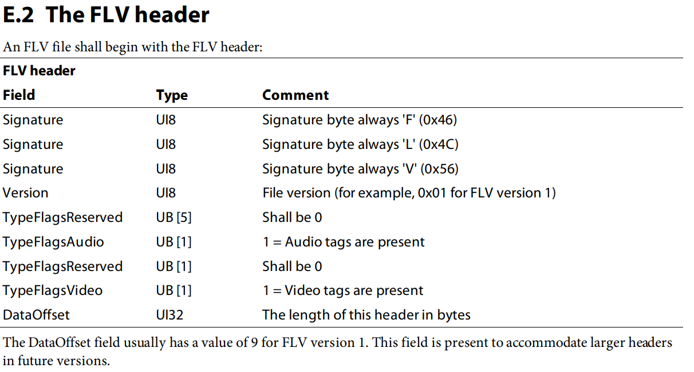
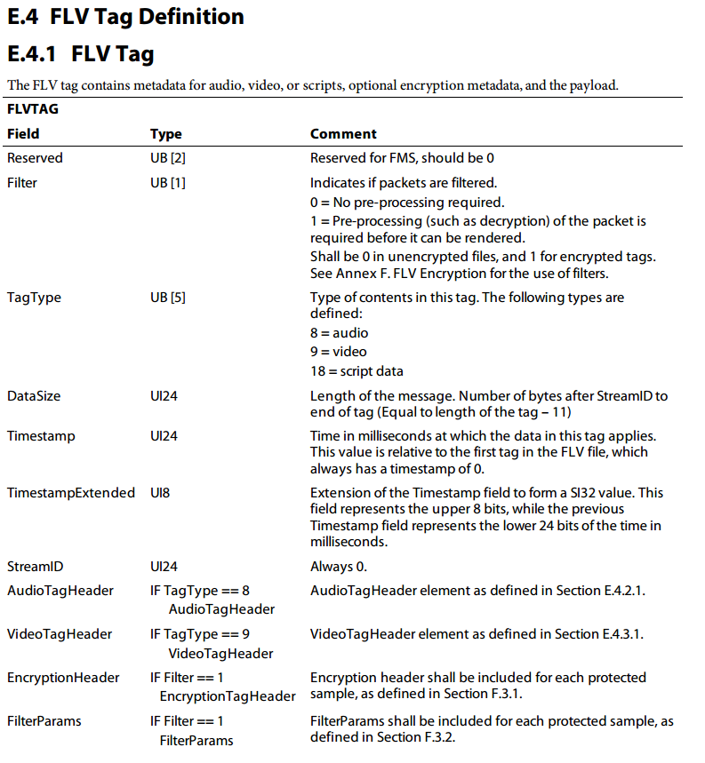
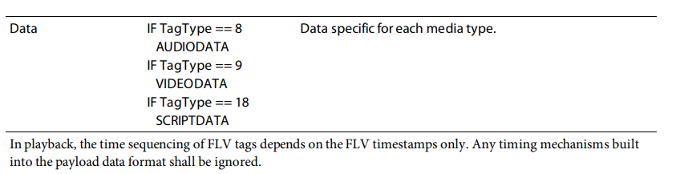

# MultiMedia

多媒体文件(.flv, .ts, .avi)被称做container

有些container可以包含很多支的video, audio, subtitle

编码格式(264, 265, aac)被称做codec



## video的主要参数

编码格式codec, 譬如AVC

帧率framerate, 譬如25fps, 就是一秒有25张图.

还有宽高这些啦, 一般的container上会有, avc的话, 在pps上也有. 有一些不标准的码流, container上的可能是错的.

色彩空间colorspace, 譬如YUV 420P, 也就是编码之前的数据, 形容的是1个色度分量对应了4个亮度分量, 这样子的好处是减少带宽, 而且大多数显示设备都支持这种colorspace, 省去转换colorspace的耗时.


## audio的主要参数

编码格式codec, 譬如AAC

采样率sample_rate, 譬如44.1kHz

通道数channels, 譬如2, 就有左右声道, 立体声

PCM 就是编码之前的数据, 根据采样率来算, 譬如44.1kHz, 就是一秒有44.1k个数据.

如果是双通道, 数据量就要double了. 还有一个指标是format, 譬如16bit, 意思是每个数据有2个byte.


# Player

普通的播放flow

source-->打开码流, 一般是本地或者网络

vm-->模拟一个多媒体在内存中打开

demuxer-->读取vm中的资料, 从而无视码流到底是从哪里来

rb-->demuxer会将video/audio/subtitle分离开来, 分别存下来

decoder->decoder会从这些rb里边读取数据

rb->解码出来的数据也会存到一个地方

renderer->通过音画同步把数据播放出去


# ffmpeg Version

3.4 release

https://github.com/FFmpeg/FFmpeg/releases/tag/n3.4


## 下载ffmpeg     

wget http://ffmpeg.org/releases/ffmpeg-3.4.tar.bz2

或者git clone git@github.com:FFmpeg/FFmpeg.git 

git 下载的都是最新的源码, 不确定性比较高. 最好还是搞个release版本来玩玩先.


## 介绍./configure的参数

./configure --help > help.cfg

还可以在./ffbuild/config.log查看log


我个人觉得可能要修改的参数

## mac编译脚本

export PREFIX=./mac

--prefix=$PREFIX  安装路径

mac 默认出不来ffplay, 需要做下列步骤

brew install automake fdk-aac git libtool libvorbis libvpx opus sdl sdl2 shtool yasm texi2html theora wget x264 xvid lame libass


## an编译脚本

export NDK=/Users/knox/Documents/envOrTool/android/android-ndk-r14b

export PLATFORM=$NDK/platforms/android-21/arch-arm

export TOOLCHAIN=$NDK/toolchains/arm-linux-androideabi-4.9/prebuilt/darwin-x86_64

export CPU=armv7-a

export PREFIX=./android/$CPU


## ffmpeg提供一系列的doc




## 简单展示ffplay的播放功能

ffplay -i ./data/AngryBirds.flv


# Introduction

## 简介ffmpeg的常用类或叫结构体

AVFormatContext *pFormatCtx 扮演container, 入参可以是文件, 可以是url

AVStream *pStream 扮演video/audio/subtitle流

AVPacket packet 扮演包, 是压缩过的.

AVCodecContext *pCodecCtx 扮演编解码器上下文

AVCodec *pCodec 扮演编解码器

AVFrame *pFrame 扮演帧, 且是未被压缩的


# RTFC

## mac&An App

### player4mac

简单播放器, 播放flv


#### kplay.c

target: 打开一个flv影片, 将video剥离出来并且解码, 把解码后的数据存起来, 远观一下.

gcc -o kplay kplay.c -I./include/ -L./lib/ -lavcodec -lavformat -lswscale -lz -lm

./mac/kplay2 ../data/AngryBirds.flv

我们将ffmpeg的常用套路抽离出来看看

```c
#include <libavcodec/avcodec.h>
#include <libavformat/avformat.h>

// 注册所有的文件格式和编解码器的库
av_register_all();

// 打开多媒体文件
AVFormatContext *pFormatCtx = NULL;
avformat_open_input(&pFormatCtx, url, NULL, NULL);

// 解析流讯息
avformat_find_stream_info(pFormatCtx, NULL);

// 找到视频流
int videoStream = -1;
int i;
for (i = 0; i < pFormatCtx->nb_streams; i++)
{
	if (pFormatCtx->streams[i]->codec->codec_type == AVMEDIA_TYPE_VIDEO)
	{
		videoStream = i;
		break;
    }
}

// 获取视频编解码器上下文
AVCodecContext *pCodecCtx = NULL;
pCodecCtx = pFormatCtx->streams[videoStream]->codec;

// 找到对应的视频解码器
AVCodec *pCodec = NULL;
pCodec = avcodec_find_decoder(pCodecCtx->codec_id);

// 打开解码器
avcodec_open2(pCodecCtx, pCodec, NULL);

// 分配视频帧内存空间
pFrame = av_frame_alloc();

// 读取媒体文件里边的视频包
AVPacket packet;
av_read_frame(pFormatCtx, &packet);

// 解码视频帧
if (packet.stream_index == videoStream)
{
    int frameFinished;
    avcodec_decode_video2(pCodecCtx, pFrame, &frameFinished, &packet);
    if (frameFinished)
    {
        saveIt()
    }
}

// 释放packet, 它是在av_read_frame里边分配内存packet.data
av_free_packet(&packet);

releaseResource()
```

上面其实已经完成了视频解码, 至于解码后的yuv用来干嘛, 就各凭本事了.

存成RGB格式的PPM来看看.

```c
#include <libswscale/swscale.h>

static unsigned sws_flags = SWS_BICUBIC;
saveIt()
{
    // 配置sw scale, 用来将原本的数据格式转换成rgb24的
    struct SwsContext *img_convert_ctx = NULL;
    img_convert_ctx = sws_getCachedContext(img_convert_ctx, pFrame->width, pFrame->height, pFrame->format, pFrame->width, pFrame->height, AV_PIX_FMT_RGB24, sws_flags, NULL, NULL, NULL);
    
    // 分配RGB的视频帧内存空间
    pFrameRGB = av_frame_alloc();
    
    // 申请放置原始数据的内存空间
    uint8_t *buffer;
    int numBytes;
    numBytes = avpicture_get_size(AV_PIX_FMT_RGB24, pCodecCtx->width, pCodecCtx->height);
    buffer = (uint8_t *)av_malloc(numBytes * sizeof(uint8_t));

    // 把帧和新申请的内存结合起来
    avpicture_fill((AVPicture *)pFrameRGB, buffer, AV_PIX_FMT_RGB24, pCodecCtx->width, pCodecCtx->height);
    
    // 转换格式
    sws_scale(img_convert_ctx, pFrame->data, pFrame->linesize, 0, pCodecCtx->height, pFrameRGB->data, pFrameRGB->linesize);
    
    // 写ppm文件
    AVFrame *pFrame = pFrameRGB
    int iFrame = 1;
    int width = pCodecCtx->width;
    int height = pCodecCtx->height;
    
    FILE *pFile;
    char szFilename[32];
    int y;

    // 打开文件
    sprintf(szFilename, "frame%d.ppm", iFrame);
    pFile = fopen(szFilename, "wb");
    if (pFile == NULL)
    {
        printf("open file failed!\n");
        return;
    }

    // 写文件头
    fprintf(pFile, "P6\n%d %d\n255\n", width, height);

    // 写像素数据
    for (y = 0; y < height; ++y)
    {
        fwrite(pFrame->data[0] + y * pFrame->linesize[0], 1, width * 3, pFile);
    }

    // 关闭文件
    fclose(pFile);
}
```

释放资源

```c
releaseResource()
{
    // 释放RGB image
    av_free(buffer);
    av_free(pFrameRGB);

    // 释放yuv image
    av_free(pFrame);

    // 关闭codec
    avcodec_close(pCodecCtx);

    // 关闭视频文件
    avformat_close_input(&pFormatCtx);

    // 释放sws
    sws_freeContext(img_convert_ctx);
}
```


#### kplay2.c

target: 打开一个flv影片, 将video剥离出来并且解码, 并且渲染出来.

查看sdl的gcc编译参数

[knox @ app]$ sdl-config --cflags --libs
-I/usr/local/include/SDL -D_GNU_SOURCE=1 -D_THREAD_SAFE
-L/usr/local/lib -lSDLmain -lSDL -Wl,-framework,Cocoa

gcc -o kplay2 kplay2.c -I./include/ -L./lib/ -lavcodec -lavformat -lswscale -lz -lm \`sdl-config --cflags --libs`

跟上个例子的区别就是将video给渲染出来. 所以将saveIt()换成renderIt()就好, mac上用SDL来做render, SDL不是学习的重点@@  所以不深究了.

```c
#include <libswscale/swscale.h>
#include <SDL.h>
#include <SDL_thread.h>

static unsigned sws_flags = SWS_BICUBIC;
renderIt()
{
    // 配置sw scale, 用来将原本的数据格式转换成yuv420p的
    struct SwsContext *img_convert_ctx = NULL;
    img_convert_ctx = sws_getCachedContext(img_convert_ctx, pFrame->width, pFrame->height, pFrame->format, pFrame->width, pFrame->height, AV_PIX_FMT_YUV420P, sws_flags, NULL, NULL, NULL);
    
    // 初始化SDL
    SDL_Surface *screen = NULL;
    SDL_Overlay *bmp = NULL;
    SDL_Init(SDL_INIT_VIDEO | SDL_INIT_AUDIO | SDL_INIT_TIMER);
    screen = SDL_SetVideoMode(pCodecCtx->width, pCodecCtx->height, 0, 0);
    bmp = SDL_CreateYUVOverlay(pCodecCtx->width, pCodecCtx->height,SDL_YV12_OVERLAY, screen);
    
    // 配置窗口的位置
    SDL_Rect rect;
    rect.x = 0;
    rect.y = 0;
    rect.w = pCodecCtx->width;
    rect.h = pCodecCtx->height;
    
    // 将数据拷贝到SDL_Overlay, 先锁住
    SDL_LockYUVOverlay(bmp);
    
    // 像素pixel  间距pitch
	AVPicture pict;
	pict.data[0] = bmp->pixels[0];
	pict.data[1] = bmp->pixels[2];
	pict.data[2] = bmp->pixels[1];

	pict.linesize[0] = bmp->pitches[0];
	pict.linesize[1] = bmp->pitches[2];
	pict.linesize[2] = bmp->pitches[1];
    
    // 转换数据格式
    sws_scale(img_convert_ctx, pFrame->data, pFrame->linesize, 0, pCodecCtx->height, pict.data, pict.linesize);
    
    // 解锁SDL_Overlay
    SDL_UnlockYUVOverlay(bmp);
    
    // 渲染到指定区域
    SDL_DisplayYUVOverlay(bmp, &rect);
}
```

释放资源

```c
releaseResource()
{
    // 释放yuv image
    av_free(pFrame);

    // 关闭codec
    avcodec_close(pCodecCtx);

    // 关闭视频文件
    avformat_close_input(&pFormatCtx);

    // 释放sws
    sws_freeContext(img_convert_ctx);

    // 退出SDL
    SDL_Quit();
}
```


#### kplay3.c

target: 打开一个flv影片, 将video和audio都剥离出来, 并且解码, 视频渲染出来, 音频播放出来

gcc -o kplay3 kplay3.c -I./include/ -L./lib/ -lavcodec -lavformat -lavutil -lswscale -lswresample -lz -lm \`sdl-config --cflags --libs`

我们只关注音频的flow

```c
// 找到音频流
int audioStream = -1;
find_audio_index()
{
    int i;
    for (i = 0; i < pFormatCtx->nb_streams; i++)
    {
        if (pFormatCtx->streams[i]->codec->codec_type == AVMEDIA_TYPE_AUDIO && audioStream < 0)
        {
            audioStream = i;
        }
    }
}

// 获取音频编解码器上下文
AVCodecContext *aCodecCtx = NULL;
aCodecCtx = pFormatCtx->streams[audioStream]->codec;

// 找到音频解码器
AVCodec *aCodec = NULL;
aCodec = avcodec_find_decoder(aCodecCtx->codec_id);

// 打开音频解码器
avcodec_open2(aCodecCtx, aCodec, NULL);

// 由于我们用SDL来播放音频, SDL是通过回调来请求pcm的, 所以音频flow在这里跟video有一点区别
initSDLAudio();

// 读取音频packet,丢到queue里边
av_read_frame(pFormatCtx, &packet)
if (packet.stream_index == audioStream)
{
	packet_queue_put(&audioq, &packet);
	// audio不能释放packet, 因为还没解码
}
```

接下来又是不太重要的SDL audio配置

```c
#include <libavutil/mathematics.h>
#include <libswresample/swresample.h>

#define SDL_AUDIO_MIN_BUFFER_SIZE 512
#define SDL_AUDIO_MAX_CALLBACKS_PER_SEC 30

initSDLAudio()
{
    /*
    ** 构建音频播放器的参数
    ** wanted_spec.freq采样率用码流音频的采样率, 如果不一定, 输出的声音听着很怪
    ** wanted_spec.format音频格式用s16,也就是16bit,大多数音频播放器都支持这种格式
    ** wanted_spec.channels通道数选2,播出的是立体声
    ** wanted_spec.samples这个是抄ffplay的,应该是指音频那路的缓存采样数的多少
    ** wanted_spec.callback是音频播放的回调函数
    ** wanted_spec.userdata是回调函数的入参
    */
    SDL_AudioSpec wanted_spec;
    wanted_spec.freq = aCodecCtx->sample_rate;
    wanted_spec.format = AUDIO_S16SYS;
    wanted_spec.channels = 2;
    wanted_spec.silence = 0;
    wanted_spec.samples = FFMAX(SDL_AUDIO_MIN_BUFFER_SIZE, 2 << 	av_log2(wanted_spec.freq / SDL_AUDIO_MAX_CALLBACKS_PER_SEC));
    wanted_spec.callback = audio_callback;
    wanted_spec.userdata = aCodecCtx;
    
    // 打开音频播放设备
    SDL_AudioSpec spec;
    SDL_OpenAudio(&wanted_spec, &spec);
    
    // 初始化AudioQueue
    packet_queue_init(&audioq);
    SDL_PauseAudio(0);
}

void audio_callback(void *userdata, Uint8 *stream, int len)
{
    // 这就是回调函数入参
    AVCodecContext *aCodecCtx = (AVCodecContext *) userdata;
    
    // 获取pcm
    len1 = audio_decode_frame(aCodecCtx, aFrame, &audio_buf);
    
    // 将pcm送给音频播放器
    memcpy(stream, (uint8_t *)audio_buf, len1);
}

int audio_decode_frame(AVCodecContext *aCodecCtx, AVFrame *aFrame, uint8_t **pcm)
{
    // 从AudioQueue中拿出音频packet
    static AVPacket pkt;
    packet_queue_get(&audioq, &pkt, 1);
    
    // 音频解码
    int got_output = 0;
    avcodec_decode_audio4(aCodecCtx, aFrame, &got_output, &pkt);
    if (got_output)
    {
        /*
        ** 因为aac解码出来的pcm格式,不一定是AV_SAMPLE_FMT_S16,所以不能直接播放
        ** 需要申请一块内存空间,存放这次解码并且转换之后的pcm
        */
        // nb_samples表示frame里边采样数,每个采样点的大小是av_get_bytes_per_sample(AV_SAMPLE_FMT_S16)
        int out_size = 2 * aFrame->nb_samples * av_get_bytes_per_sample(AV_SAMPLE_FMT_S16);
        *pcm = av_malloc(out_size);
        
        // 将pcm从原来的数据格式转换成s16
        uint8_t **out = pcm;
        int len = swr_convert(au_convert_ctx, out, aFrame->nb_samples + 256, (const uint8_t **)aFrame->extended_data, aFrame->nb_samples);
        
        // 返回resample_size, len是采样数, 2是两通道
        return len * 2 * av_get_bytes_per_sample(AV_SAMPLE_FMT_S16);
    }
}
```


#### kplay4.c

target: 重构kplay3, render在main-thread, demux在read-thread, video decode在video-thread, audio decode在SDLAudio的callback-thread

gcc -o kplay4 kplay4.c -I./include/ -L./lib/ -lavcodec -lavformat -lavutil -lswscale -lswresample -lz -lm \`sdl-config --cflags --libs`


### player4An


## 纸上谈兵

播放flow的主体也大致描述了. 但是还有很多细节的东西, 如果看ffplay, 就能发现还有很多操作. 毕竟从实验室demo到成熟的产品, 有90%是实验室外面付出的, 甚至更多啦.

所以挑了一些点切入ffmpeg源码, 拿flv来做例子

### ffmpeg probe

是如何检查影片属于哪种container的

```c
int avformat_open_input(AVFormatContext **ps, const char *filename, AVInputFormat *fmt, 	AVDictionary **options)
{
    s->url = av_strdup(filename ? filename : "");
    init_input(s, filename, &tmp);
}

static int init_input(AVFormatContext *s, const char *filename, AVDictionary **options)
{
    av_probe_input_buffer2(s->pb, &s->iformat, filename, s, 0, s->format_probesize);
}

int av_probe_input_buffer2(AVIOContext *pb, AVInputFormat **fmt, const char *filename,     void *logctx, unsigned int offset, unsigned int max_probe_size)
{
    for (probe_size = PROBE_BUF_MIN; probe_size <= max_probe_size && !*fmt; probe_size         = FFMIN(probe_size << 1, FFMAX(max_probe_size, probe_size + 1)))
    {
        // 拿一块大小合适的data来做probe
        *fmt = av_probe_input_format2(&pd, 1, &score);
    }
}

AVInputFormat *av_probe_input_format2(AVProbeData *pd, int is_opened, int *score_max)
{
    AVInputFormat *fmt = av_probe_input_format3(pd, is_opened, &score_ret);
}

AVInputFormat *av_probe_input_format3(AVProbeData *pd, int is_opened, int *score_ret)
{
    AVInputFormat *fmt1 = NULL
    // 轮询支持的AVInputFormat
    while ((fmt1 = av_iformat_next(fmt1))) {
        // 调用每个AVInputFormat的read_probe方法,各自给出一个分数score
        score = fmt1->read_probe(&lpd);
        // 记下分数最高的那个AVInputFormat
        if (score > score_max) {
			score_max = score;
			fmt       = fmt1;
		}
    }
    // 返回的就是最合适的那个AVInputFormat
    return fmt;
}
```

flv demuxer

```c
// 调用AVInputFormat的read_probe方法,也就是调用flv_probe方法
AVInputFormat ff_flv_demuxer = {
	.name           = "flv",
	.long_name      = NULL_IF_CONFIG_SMALL("FLV (Flash Video)"),
	.priv_data_size = sizeof(FLVContext),
	.read_probe     = flv_probe,
	.read_header    = flv_read_header,
	.read_packet    = flv_read_packet,
	.read_seek      = flv_read_seek,
	.read_close     = flv_read_close,
	.extensions     = "flv",
	.priv_class     = &flv_class,
};

static int flv_probe(AVProbeData *p)
{
	return probe(p, 0);
}

static int probe(AVProbeData *p, int live)
{
	const uint8_t *d = p->buf;
	unsigned offset = AV_RB32(d + 5);

	if (d[0] == 'F' &&
		d[1] == 'L' &&
		d[2] == 'V' &&
		d[3] < 5 && d[5] == 0 &&
		offset + 100 < p->buf_size &&
		offset > 8) {
		int is_live = !memcmp(d + offset + 40, "NGINX RTMP", 10);

		if (live == is_live)
			return AVPROBE_SCORE_MAX;
	}
	return 0;
}
```

插图一张, 用十六进制看看flv文件的内容.



插图一张, flv的文件头结构




```c
int avformat_open_input(AVFormatContext **ps, const char *filename, AVInputFormat *fmt, 	AVDictionary **options)
{
    // 找到对应的demuxer
    s->url = av_strdup(filename ? filename : "");
    init_input(s, filename, &tmp);
    
    // parse header
    s->iformat->read_header(s);
}

static int flv_read_header(AVFormatContext *s)
{
    // 找到第5个字节, 然后判断有没有stream
    avio_skip(s->pb, 4);
	flags = avio_r8(s->pb);
	flv->missing_streams = flags & (FLV_HEADER_FLAG_HASVIDEO | 								FLV_HEADER_FLAG_HASAUDIO);
    
    // 跳过FLV Header
	offset = avio_rb32(s->pb);
	avio_seek(s->pb, offset, SEEK_SET);
    
    /* Annex E. The FLV File Format
	* E.3 TheFLVFileBody
	*     Field               Type    Comment
	*     PreviousTagSize0    UI32    Always 0
	* 检查这支FLV是否足够标准
	* */
	pre_tag_size = avio_rb32(s->pb);
	if (pre_tag_size) {
		av_log(s, AV_LOG_WARNING, "Read FLV header error, input file is not a standard 		       flv format, first PreviousTagSize0 always is 0\n");
	}
}
```


### ffmpeg get stream info

找到container里边的video/audio/subtitle的基本信息

插图一张, flv的tag结构






```c
int avformat_find_stream_info(AVFormatContext *ic, AVDictionary **options)
{
    for (;;) 
    {
        ret = read_frame_internal(ic, &pkt1);
        if (ret < 0) {
			/* EOF or error*/
			eof_reached = 1;
            // 可以看出决心很大
			break;
		}
    }
}

static int read_frame_internal(AVFormatContext *s, AVPacket *pkt)
{
    // 找不到packet就不退出
    while (!got_packet && !s->internal->parse_queue)
    {
        ff_read_packet(s, &cur_pkt);
    }
}

int ff_read_packet(AVFormatContext *s, AVPacket *pkt)
{
    for (;;) 
    {
        s->iformat->read_packet(s, pkt);
    }
}

static int flv_read_packet(AVFormatContext *s, AVPacket *pkt)
{
    // 读TagType(8bits)
    type = (avio_r8(s->pb) & 0x1F);
    
    // 读DataSize(24bits)
    orig_size = size = avio_rb24(s->pb);
    
    // 读Timestamp(24bits)
    dts  = avio_rb24(s->pb);
    
    // 读TimestampExtended(8bits)
    dts |= (unsigned)avio_r8(s->pb) << 24;
    
    // 跳过StreamId(24bits, always 0)
    avio_skip(s->pb, 3);
    
    // 判断当前的tag是audio/video/meta/else
    if (type == FLV_TAG_TYPE_AUDIO)
    {
        stream_type = FLV_STREAM_TYPE_AUDIO;
    }
    else if (type == FLV_TAG_TYPE_VIDEO)
    {
        stream_type = FLV_STREAM_TYPE_VIDEO;
    }
    else if (type == FLV_TAG_TYPE_META)
    {
        stream_type=FLV_STREAM_TYPE_DATA;
    }
    else 
    {
        
    }
    
    // 如果是新的stream, 创建新的AVStream
    if (i == s->nb_streams)
    {
        AVStream *st = NULL;
        static const enum AVMediaType stream_types[] = {AVMEDIA_TYPE_VIDEO,                     	AVMEDIA_TYPE_AUDIO, AVMEDIA_TYPE_SUBTITLE};
		st = create_stream(s, stream_types[stream_type]);
    }
    
    // 创建索引表, 如果是video且是key_frame, 就记录. 如果是audio, 直接记录.
    if ((s->pb->seekable & AVIO_SEEKABLE_NORMAL) && ((flags & FLV_VIDEO_FRAMETYPE_MASK)     	== FLV_FRAME_KEY || stream_type == FLV_STREAM_TYPE_AUDIO))
		av_add_index_entry(st, pos, dts, size, 0, AVINDEX_KEYFRAME);
    
    // 提取audio讯息
    if (stream_type == FLV_STREAM_TYPE_AUDIO)
    {
        // 通道数
        channels = (flags & FLV_AUDIO_CHANNEL_MASK) == FLV_STEREO ? 2 : 1;
        
        // 采样率
        sample_rate = 44100 << ((flags & FLV_AUDIO_SAMPLERATE_MASK) >>                             FLV_AUDIO_SAMPLERATE_OFFSET) >> 3;
        
        // 每个采样点的大小
        bits_per_coded_sample = (flags & FLV_AUDIO_SAMPLESIZE_MASK) ? 16 : 8;
        
        // 编码格式
        flv_set_audio_codec(s, st, st->codecpar, flags & FLV_AUDIO_CODECID_MASK);
    }
    // 提取video讯息
    else if (stream_type == FLV_STREAM_TYPE_VIDEO)
    {
        // 编码格式
        flv_set_video_codec(s, st, flags & FLV_VIDEO_CODECID_MASK, 1);
    }
    // 提取data讯息
    else if (stream_type == FLV_STREAM_TYPE_DATA)
    {
        
    }
    
    // 进一步提取讯息
    if (st->codecpar->codec_id == AV_CODEC_ID_AAC ||
       st->codecpar->codec_id == AV_CODEC_ID_H264 ||
       st->codecpar->codec_id == AV_CODEC_ID_MPEG4)
    {
        int type = avio_r8(s->pb);
        if (st->codecpar->codec_id == AV_CODEC_ID_H264 ||
            st->codecpar->codec_id == AV_CODEC_ID_MPEG4) {
			// sign extension
			int32_t cts = (avio_rb24(s->pb) + 0xff800000) ^ 0xff800000;
			pts = dts + cts;
    	}
    }
    
    // 构建AVPacket
    ret = av_get_packet(s->pb, pkt, size);
    pkt->dts          = dts;
    pkt->pts          = pts == AV_NOPTS_VALUE ? dts : pts;
    pkt->stream_index = st->index;
    pkt->pos          = pos;
}
```


# More

## Nginx


## OpenGL


## OpenGrok

源码

https://github.com/oracle/opengrok/releases/tag/1.1-rc21

参考blog

http://blog.csdn.net/ds1130071727/article/details/78687038

http://blog.csdn.net/w860316/article/details/72796295

http://blog.csdn.net/finewind/article/details/47362525

http://blog.csdn.net/zhanglf02/article/details/73565354