# 增: 图片水印

.\ffmpeg.exe -i .\record-1280x720-1506336560706.mp4 -i .\iqiyi-logo.png -filter_complex overlay overlay-record.mp4

* -filter_complex表示用的是complex filter, ffmpeg有两种filter, simple filter表示one-in-one-out, complex filter则是N-in-N-out
* overlay是complex filter中的一种, overlay则是一种two-in-one-out的filter, 接收很多种参数, 详情看ffmpeg-filters.html


# 删: 图片水印

.\ffmpeg.exe -i .\overlay-record.mp4 -vf delogo=1:1:220:91:1:1 delogo2-record.mp4

* -vf表示用video的filter, 也可以写成-filter:v
* delogo是video filter中的一种, 接收很多种参数, 详情看ffmpeg-filters.html
* 1:1:220:91:1:1分别是x:y:width:height:band:show, band已经被弃用了, show如果是1, 则会有绿框把矩形范围圈起来, 默认是0


# 改: video的resolution

.\ffmpeg.exe -i .\record-1280x720-1506336560706.mp4 -vf scale=960:-1 scale-record.mp4

- 原始video的resolution是1280x720, 改成960x-1, -1是特殊用法, 会自动保持原来的比例
- -vf表示用video的filter, 也可以写成-filter:v
- scale是video filter中的一种, 接收很多种参数, 详情看ffmpeg-filters.html


# 改: 剪切影片时长

.\ffmpeg.exe -i .\record-1280x720-1506336560706.mp4 -ss 00:00:03 -t 00:00:06 03-6-record.mp4

* -ss开始剪切的时间点
* -t剪切的时长


# 改: 裁剪影片

.\ffmpeg.exe -i .\record-1280x720-1506336560706.mp4 -filter_complex crop=576:720:287:0 crop-record.mp4

* 利用crop filter来裁剪影片
* crop=w:h​:X:​y


# 改: 旋转影片

.\ffmpeg.exe -i .\record-1280x720-1506336560706.mp4 -filter_complex transpose=1 transpose1-record.mp4

* transpose如果是1,表示顺时针旋转90°, 如果是2, 表示逆时针旋转90°


# 改: 上下镜像

.\ffmpeg.exe -i .\record-1280x720-1506336560706.mp4 -vf vflip vflip-record.mp4

* 利用vflip这个filter


# 改: 左右镜像

.\ffmpeg.exe -i .\record-1280x720-1506336560706.mp4 -vf hflip hflip-record.mp4

* 利用hflip这个filter


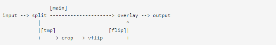


# 改: 各种滤镜看效果

## sample


## boxblur

.\ffmpeg.exe -i .\o__Sample.gif -vf boxblur=luma_radius=min(h\,w)/10:luma_power=1:chorma_radius=min(cw\.ch)/10:chroma_power=1 target.gif 

(check failed)

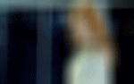


## colorbalance

.\ffmpeg.exe -i .\o__Sample.gif -vf colorbalance=rs=0.75 target.gif

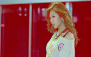


## colorchannelmixer

.\ffmpeg.exe -i .\o__Sample.gif -vf colorchannelmixer=.3:.4:.3:0:.3:.4:.3:0:.3:.4:.3 target.gif

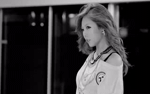


## crop

.\ffmpeg.exe -i .\o__Sample.gif -vf crop=2/3*in_w:2/3*in_h target.gif

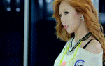


## delogo

.\ffmpeg.exe -i .\o__Sample.gif -vf delogo=x=70:y=20:w=20:h=20 target.gif

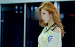


## drawbox

.\ffmpeg.exe -i .\o__Sample.gif -vf drawbox=x=10:y=20:w=50:h=30:color=red target.gif

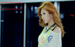


.\ffmpeg.exe -i .\o__Sample.gif -vf drawbox=x=10:y=20:w=50:h=30:color=pink@0.5:t=max target.gif

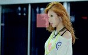


## drawtext

.\ffmpeg.exe -i .\o__Sample.gif -vf drawtext='fontfile=_ht.ttf:x=20:y=10:fontsize=5:fontcolor=#FFFFFF:box=1:boxcolor=red@0.2:shadowcolor=#303030:shadow
x=2:shadowy=2:text=DRAWTEXT' target.gif

(check failed)

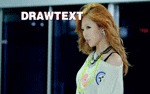


## edgedetect

.\ffmpeg.exe -i .\o__Sample.gif -vf edgedetect=low=0.1:high=0.6 target.gif

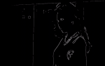


## fade

.\ffmpeg.exe -i .\o__Sample.gif -vf fade=in:0:30 target.gif

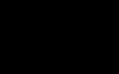


## framestep

.\ffmpeg.exe -i .\o__Sample.gif -vf framestep=8 target.gif


## hflip

.\ffmpeg.exe -i .\o__Sample.gif -vf hflip target.gif

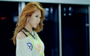


## hqdn3d

.\ffmpeg.exe -i .\o__Sample.gif -vf hqdn3d=20 target.gif


## hue

.\ffmpeg.exe -i .\o__Sample.gif -vf hue='s=min(t/2\,1)' target.gif

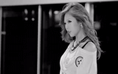


.\ffmpeg.exe -i .\o__Sample.gif -vf hue='h=60:s=-3' target.gif

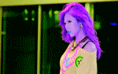


## lutrgb

.\ffmpeg.exe -i .\o__Sample.gif -vf lutrgb='r=negval:g=negval:b=negval' target.gif

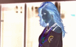


.\ffmpeg.exe -i .\o__Sample.gif -vf lutrgb='g=0:b=0' target.gif

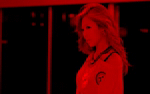


## lutyuv

.\ffmpeg.exe -i .\o__Sample.gif -vf lutyuv=y=negval target.gif

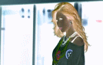


.\ffmpeg.exe -i .\o__Sample.gif -vf lutyuv='u=128:v=128' target.gif

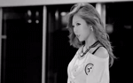


## mp

.\ffmpeg.exe -i .\o__Sample.gif -vf mp=eq2=1.0:2:0.5 target.gif

(check failed)

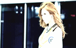


## noise

.\ffmpeg.exe -i .\o__Sample.gif -vf noise=alls=20:allf=t+u target.gif


## pad

.\ffmpeg.exe -i .\o__Sample.gif -vf pad='3/2*iw:3/2*ih:(ow-iw)/2:(oh-ih)/2' target.gif

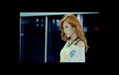


## setpts

.\ffmpeg.exe -i .\o__Sample.gif -vf setpts=2.0*PTS target.gif


.\ffmpeg.exe -i .\o__Sample.gif -vf setpts=0.5*PTS target.gif


## stereo3d

.\ffmpeg.exe -i .\o__Sample.gif -vf stereo3d=sbsl:aybd target.gif

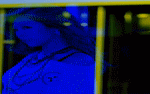


.\ffmpeg.exe -i .\o__Sample.gif -vf stereo3d=abl:sbsr target.gif

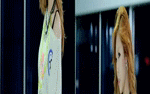


## thumbnail

.\ffmpeg.exe -i .\o__Sample.gif -vf thumbnail=8 target.gif

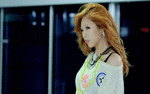


## tile

.\ffmpeg.exe -i .\o__Sample.gif -vf tile=3x2:nb_frames=5:padding=7:margin=2 target.gif

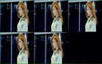


## transpose

.\ffmpeg.exe -i .\o__Sample.gif -vf transpose=1:portrait target.gif

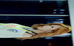


## unsharp

.\ffmpeg.exe -i .\o__Sample.gif -vf unsharp=7:7:-2:7:7:-2 target.gif

(check failed)

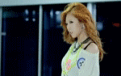


## vflip

.\ffmpeg.exe -i .\o__Sample.gif -vf vflip target.gif

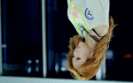


# 常用滤镜

常用的滤镜中重点的是：scale、trim、overlay、yadif、rotate、movie

比如常用的scale 可以用来做缩放，trim可以做比较精确的帧级的剪切，overlay可以来实现视频混流，画中画或多画面等叠加处理，rotate来做旋转，movie可以加载第三方的视频等等，yadif可以在摄像机上做隔行扫描，在PC端的播放器可以做去交错。另外，还有delogo、crop、colorkey、chromakey、zoompan； delogo可以用来模糊化某一区域，crop用于图像区域剪切，colorkey和chromakey是用于抠图的，chromakey以YUV输入为主，colorkey以RGB输入为主，zoompan可以将图像放大。


# help

```cmd
PS D:\Desktop\ffmpeg-20170225-7e4f32f-win64-static\bin> .\ffmpeg.exe -h filter=rotate
ffmpeg version N-83657-g7e4f32f Copyright (c) 2000-2017 the FFmpeg developers
  built with gcc 6.3.0 (GCC)
  configuration: --enable-gpl --enable-version3 --enable-cuda --enable-cuvid --enable-d3d11va --enable-dxva2 --enable-libmfx --enable-nvenc --enable-avisynth --enable-bzlib --enable-fontconfig --enable-frei0r --enable-gnutls --enable-iconv --enable-libass --enable-libbluray --enable-libbs2b --enable-libcaca --enable-libfreetype --enable-libgme --enable-libgsm --enable-libilbc --enable-libmodplug --enable-libmp3lame --enable-libopencore-amrnb --enable-libopencore-amrwb --enable-libopenh264 --enable-libopenjpeg --enable-libopus --enable-librtmp --enable-libsnappy --enable-libsoxr --enable-libspeex --enable-libtheora --enable-libtwolame --enable-libvidstab --enable-libvo-amrwbenc --enable-libvorbis --enable-libvpx --enable-libwavpack --enable-libwebp --enable-libx264 --enable-libx265 --enable-libxavs --enable-libxvid --enable-libzimg --enable-lzma --enable-zlib
  libavutil      55. 47.100 / 55. 47.100
  libavcodec     57. 81.100 / 57. 81.100
  libavformat    57. 66.102 / 57. 66.102
  libavdevice    57.  2.100 / 57.  2.100
  libavfilter     6. 74.100 /  6. 74.100
  libswscale      4.  3.101 /  4.  3.101
  libswresample   2.  4.100 /  2.  4.100
  libpostproc    54.  2.100 / 54.  2.100
Filter rotate
  Rotate the input image.
    slice threading supported
    Inputs:
       #0: default (video)
    Outputs:
       #0: default (video)
rotate AVOptions:
  angle             <string>     ..FV.... set angle (in radians) (default "0")
  a                 <string>     ..FV.... set angle (in radians) (default "0")
  out_w             <string>     ..FV.... set output width expression (default "iw")
  ow                <string>     ..FV.... set output width expression (default "iw")
  out_h             <string>     ..FV.... set output height expression (default "ih")
  oh                <string>     ..FV.... set output height expression (default "ih")
  fillcolor         <string>     ..FV.... set background fill color (default "black")
  c                 <string>     ..FV.... set background fill color (default "black")
  bilinear          <boolean>    ..FV.... use bilinear interpolation (default true)

This filter has support for timeline through the 'enable' option.
```


# 具体场景

命令行的使用开头都是：filter_complex，然后再在后面接一些字符串，如下：

## 跑马灯

```cmd
[0:v][1:v]overlay=x='if(gte(t,0), -w+(mod(n, W+w))+5, NAN)':y=0[out]
```


## 图像旋转

```cmd
[1:v]rotate=a=60*PI/180:ow=180:oh=180[v1];[0:v][v1]overlay=x=-20:y=-20[o]
```


## delogo（模糊化某一区域）

```cmd
delogo=x=72:y=32:w=168:h=86:band=1:show=1
```


# dumpgraph


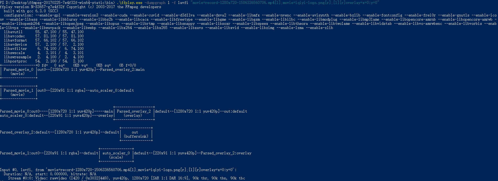


```cmd
PS D:\Desktop\ffmpeg-20170225-7e4f32f-win64-static\bin> .\ffplay.exe -dumpgraph 1 -f lavfi "movie=record-1280x720-1506336560706.mp4[l];movie=iqiyi-logo.png[r];[l][r]overlay=x=0:y=0"
ffplay version N-83657-g7e4f32f Copyright (c) 2003-2017 the FFmpeg developers
  built with gcc 6.3.0 (GCC)
  configuration: --enable-gpl --enable-version3 --enable-cuda --enable-cuvid --enable-d3d11va --enable-dxva2 --enable-libmfx --enable-nvenc --enable-avisynth --enable-bzlib --enable-fontconfig --enable-frei0r --enable-gnutls --enable-iconv --enable-libass --enable-libbluray --enable-libbs2b --enable-libcaca --enable-libfreetype --enable-libgme --enable-libgsm --enable-libilbc --enable-libmodplug --enable-libmp3lame --enable-libopencore-amrnb --enable-libopencore-amrwb --enable-libopenh264 --enable-libopenjpeg --enable-libopus --enable-librtmp --enable-libsnappy --enable-libsoxr --enable-libspeex --enable-libtheora --enable-libtwolame --enable-libvidstab --enable-libvo-amrwbenc --enable-libvorbis --enable-libvpx --enable-libwavpack --enable-libwebp --enable-libx264 --enable-libx265 --enable-libxavs --enable-libxvid --enable-libzimg --enable-lzma --enable-zlib
  libavutil      55. 47.100 / 55. 47.100
  libavcodec     57. 81.100 / 57. 81.100
  libavformat    57. 66.102 / 57. 66.102
  libavdevice    57.  2.100 / 57.  2.100
  libavfilter     6. 74.100 /  6. 74.100
  libswscale      4.  3.101 /  4.  3.101
  libswresample   2.  4.100 /  2.  4.100
  libpostproc    54.  2.100 / 54.  2.100
+----------------+0 fd=   0 aq=    0KB vq=    0KB sq=    0B f=0/0
| Parsed_movie_0 |out0--[1280x720 1:1 yuv420p]--Parsed_overlay_2:main
|    (movie)     |
+----------------+

+----------------+
| Parsed_movie_1 |out0--[220x91 1:1 rgba]--auto_scaler_0:default
|    (movie)     |
+----------------+

                                                      +------------------+
Parsed_movie_0:out0----[1280x720 1:1 yuv420p]-----main| Parsed_overlay_2 |default--[1280x720 1:1 yuv420p]--out:default
auto_scaler_0:default--[220x91 1:1 yuva420p]---overlay|    (overlay)     |
                                                      +------------------+

                                                         +--------------+
Parsed_overlay_2:default--[1280x720 1:1 yuv420p]--default|     out      |
                                                         | (buffersink) |
                                                         +--------------+

                                               +---------------+
Parsed_movie_1:out0--[220x91 1:1 rgba]--default| auto_scaler_0 |default--[220x91 1:1 yuva420p]--Parsed_overlay_2:overlay
                                               |    (scale)    |
                                               +---------------+

Input #0, lavfi, from 'movie=record-1280x720-1506336560706.mp4[l];movie=iqiyi-logo.png[r];[l][r]overlay=x=0:y=0':
  Duration: N/A, start: 0.000000, bitrate: N/A
    Stream #0:0: Video: rawvideo (I420 / 0x30323449), yuv420p, 1280x720 [SAR 1:1 DAR 16:9], 90k tbr, 90k tbn, 90k tbc
```


# 查: ffmpeg支持哪些filter

```cmd
.\ffmpeg.exe -filters

ffmpeg version N-83657-g7e4f32f Copyright (c) 2000-2017 the FFmpeg developers
  built with gcc 6.3.0 (GCC)
  configuration: --enable-gpl --enable-version3 --enable-cuda --enable-cuvid --enable-d3d11va --enable-dxva2 --enable-libmfx --enable-nvenc --enable-avisynth --enable-bzlib --enable-fontconfig --enable-frei0r --enable-gnutls --enable-iconv --enable-libass --enable-libbluray --enable-libbs2b --enable-libcaca --enable-libfreetype --enable-libgme --enable-libgsm --enable-libilbc --enable-libmodplug --enable-libmp3lame --enable-libopencore-amrnb --enable-libopencore-amrwb --enable-libopenh264 --enable-libopenjpeg --enable-libopus --enable-librtmp --enable-libsnappy --enable-libsoxr --enable-libspeex --enable-libtheora --enable-libtwolame --enable-libvidstab --enable-libvo-amrwbenc --enable-libvorbis --enable-libvpx --enable-libwavpack --enable-libwebp --enable-libx264 --enable-libx265 --enable-libxavs --enable-libxvid --enable-libzimg --enable-lzma --enable-zlib
  libavutil      55. 47.100 / 55. 47.100
  libavcodec     57. 81.100 / 57. 81.100
  libavformat    57. 66.102 / 57. 66.102
  libavdevice    57.  2.100 / 57.  2.100
  libavfilter     6. 74.100 /  6. 74.100
  libswscale      4.  3.101 /  4.  3.101
  libswresample   2.  4.100 /  2.  4.100
  libpostproc    54.  2.100 / 54.  2.100
Filters:
  T.. = Timeline support
  .S. = Slice threading
  ..C = Command support
  A = Audio input/output
  V = Video input/output
  N = Dynamic number and/or type of input/output
  | = Source or sink filter
 ... abench            A->A       Benchmark part of a filtergraph.
 ... acompressor       A->A       Audio compressor.
 ... acrossfade        AA->A      Cross fade two input audio streams.
 ... acrusher          A->A       Reduce audio bit resolution.
 T.. adelay            A->A       Delay one or more audio channels.
 ... aecho             A->A       Add echoing to the audio.
 ... aemphasis         A->A       Audio emphasis.
 ... aeval             A->A       Filter audio signal according to a specified expression.
 T.. afade             A->A       Fade in/out input audio.
 ... afftfilt          A->A       Apply arbitrary expressions to samples in frequency domain.
 ... aformat           A->A       Convert the input audio to one of the specified formats.
 ... agate             A->A       Audio gate.
 ... ainterleave       N->A       Temporally interleave audio inputs.
 ... alimiter          A->A       Audio lookahead limiter.
 ... allpass           A->A       Apply a two-pole all-pass filter.
 ... aloop             A->A       Loop audio samples.
 ... amerge            N->A       Merge two or more audio streams into a single multi-channel stream.
 T.. ametadata         A->A       Manipulate audio frame metadata.
 ... amix              N->A       Audio mixing.
 ..C anequalizer       A->N       Apply high-order audio parametric multi band equalizer.
 ... anull             A->A       Pass the source unchanged to the output.
 T.. apad              A->A       Pad audio with silence.
 ... aperms            A->A       Set permissions for the output audio frame.
 ... aphaser           A->A       Add a phasing effect to the audio.
 ... apulsator         A->A       Audio pulsator.
 ... arealtime         A->A       Slow down filtering to match realtime.
 ... aresample         A->A       Resample audio data.
 ... areverse          A->A       Reverse an audio clip.
 ... aselect           A->N       Select audio frames to pass in output.
 ... asendcmd          A->A       Send commands to filters.
 ... asetnsamples      A->A       Set the number of samples for each output audio frames.
 ... asetpts           A->A       Set PTS for the output audio frame.
 ... asetrate          A->A       Change the sample rate without altering the data.
 ... asettb            A->A       Set timebase for the audio output link.
 ... ashowinfo         A->A       Show textual information for each audio frame.
 T.. asidedata         A->A       Manipulate audio frame side data.
 ... asplit            A->N       Pass on the audio input to N audio outputs.
 ... astats            A->A       Show time domain statistics about audio frames.
 ..C astreamselect     N->N       Select audio streams
 ..C atempo            A->A       Adjust audio tempo.
 ... atrim             A->A       Pick one continuous section from the input, drop the rest.
 ... bandpass          A->A       Apply a two-pole Butterworth band-pass filter.
 ... bandreject        A->A       Apply a two-pole Butterworth band-reject filter.
 ... bass              A->A       Boost or cut lower frequencies.
 ... biquad            A->A       Apply a biquad IIR filter with the given coefficients.
 ... bs2b              A->A       Bauer stereo-to-binaural filter.
 ... channelmap        A->A       Remap audio channels.
 ... channelsplit      A->N       Split audio into per-channel streams.
 ... chorus            A->A       Add a chorus effect to the audio.
 ... compand           A->A       Compress or expand audio dynamic range.
 ... compensationdelay A->A       Audio Compensation Delay Line.
 ... crystalizer       A->A       Simple expand audio dynamic range filter.
 T.. dcshift           A->A       Apply a DC shift to the audio.
 ... dynaudnorm        A->A       Dynamic Audio Normalizer.
 ... earwax            A->A       Widen the stereo image.
 ... ebur128           A->N       EBU R128 scanner.
 ... equalizer         A->A       Apply two-pole peaking equalization (EQ) filter.
 ... extrastereo       A->A       Increase difference between stereo audio channels.
 ..C firequalizer      A->A       Finite Impulse Response Equalizer.
 ... flanger           A->A       Apply a flanging effect to the audio.
 ... hdcd              A->A       Apply High Definition Compatible Digital (HDCD) decoding.
 ... highpass          A->A       Apply a high-pass filter with 3dB point frequency.
 ... join              N->A       Join multiple audio streams into multi-channel output.
 ... loudnorm          A->A       EBU R128 loudness normalization
 ... lowpass           A->A       Apply a low-pass filter with 3dB point frequency.
 ... pan               A->A       Remix channels with coefficients (panning).
 ... replaygain        A->A       ReplayGain scanner.
 ... sidechaincompress AA->A      Sidechain compressor.
 ... sidechaingate     AA->A      Audio sidechain gate.
 ... silencedetect     A->A       Detect silence.
 ... silenceremove     A->A       Remove silence.
 ... stereotools       A->A       Apply various stereo tools.
 ... stereowiden       A->A       Apply stereo widening effect.
 ... treble            A->A       Boost or cut upper frequencies.
 ... tremolo           A->A       Apply tremolo effect.
 ... vibrato           A->A       Apply vibrato effect.
 T.C volume            A->A       Change input volume.
 ... volumedetect      A->A       Detect audio volume.
 ... aevalsrc          |->A       Generate an audio signal generated by an expression.
 ... anoisesrc         |->A       Generate a noise audio signal.
 ... anullsrc          |->A       Null audio source, return empty audio frames.
 ... sine              |->A       Generate sine wave audio signal.
 ... anullsink         A->|       Do absolutely nothing with the input audio.
 ... alphaextract      V->N       Extract an alpha channel as a grayscale image component.
 ... alphamerge        VV->V      Copy the luma value of the second input into the alpha channel of the first input.
 ... ass               V->V       Render ASS subtitles onto input video using the libass library.
 TS. atadenoise        V->V       Apply an Adaptive Temporal Averaging Denoiser.
 TS. avgblur           V->V       Apply Average Blur filter.
 T.. bbox              V->V       Compute bounding box for each frame.
 ... bench             V->V       Benchmark part of a filtergraph.
 T.. bitplanenoise     V->V       Measure bit plane noise.
 ... blackdetect       V->V       Detect video intervals that are (almost) black.
 ... blackframe        V->V       Detect frames that are (almost) black.
 TS. blend             VV->V      Blend two video frames into each other.
 T.. boxblur           V->V       Blur the input.
 TS. bwdif             V->V       Deinterlace the input image.
 TS. chromakey         V->V       Turns a certain color into transparency. Operates on YUV colors.
 ... ciescope          V->V       Video CIE scope.
 T.. codecview         V->V       Visualize information about some codecs.
 T.. colorbalance      V->V       Adjust the color balance.
 T.. colorchannelmixer V->V       Adjust colors by mixing color channels.
 TS. colorkey          V->V       Turns a certain color into transparency. Operates on RGB colors.
 T.. colorlevels       V->V       Adjust the color levels.
 TS. colormatrix       V->V       Convert color matrix.
 TS. colorspace        V->V       Convert between colorspaces.
 TS. convolution       V->V       Apply convolution filter.
 ... copy              V->V       Copy the input video unchanged to the output.
 ... cover_rect        V->V       Find and cover a user specified object.
 ..C crop              V->V       Crop the input video.
 T.. cropdetect        V->V       Auto-detect crop size.
 TS. curves            V->V       Adjust components curves.
 .S. datascope         V->V       Video data analysis.
 TS. dctdnoiz          V->V       Denoise frames using 2D DCT.
 TS. deband            V->V       Debands video.
 ... decimate          N->V       Decimate frames (post field matching filter).
 T.. deflate           V->V       Apply deflate effect.
 ... dejudder          V->V       Remove judder produced by pullup.
 T.. delogo            V->V       Remove logo from input video.
 ... deshake           V->V       Stabilize shaky video.
 ... detelecine        V->V       Apply an inverse telecine pattern.
 T.. dilation          V->V       Apply dilation effect.
 T.. displace          VVV->V     Displace pixels.
 T.. drawbox           V->V       Draw a colored box on the input video.
 ... drawgraph         V->V       Draw a graph using input video metadata.
 T.. drawgrid          V->V       Draw a colored grid on the input video.
 T.C drawtext          V->V       Draw text on top of video frames using libfreetype library.
 T.. edgedetect        V->V       Detect and draw edge.
 ... elbg              V->V       Apply posterize effect, using the ELBG algorithm.
 T.C eq                V->V       Adjust brightness, contrast, gamma, and saturation.
 T.. erosion           V->V       Apply erosion effect.
 ... extractplanes     V->N       Extract planes as grayscale frames.
 .S. fade              V->V       Fade in/out input video.
 ... fftfilt           V->V       Apply arbitrary expressions to pixels in frequency domain.
 ... field             V->V       Extract a field from the input video.
 ... fieldhint         V->V       Field matching using hints.
 ... fieldmatch        N->V       Field matching for inverse telecine.
 T.. fieldorder        V->V       Set the field order.
 ... find_rect         V->V       Find a user specified object.
 ... format            V->V       Convert the input video to one of the specified pixel formats.
 ... fps               V->V       Force constant framerate.
 ... framepack         VV->V      Generate a frame packed stereoscopic video.
 ... framerate         V->V       Upsamples or downsamples progressive source between specified frame rates.
 T.. framestep         V->V       Select one frame every N frames.
 ... frei0r            V->V       Apply a frei0r effect.
 T.. fspp              V->V       Apply Fast Simple Post-processing filter.
 TS. gblur             V->V       Apply Gaussian Blur filter.
 T.. geq               V->V       Apply generic equation to each pixel.
 T.. gradfun           V->V       Debands video quickly using gradients.
 TS. haldclut          VV->V      Adjust colors using a Hald CLUT.
 TS. hflip             V->V       Horizontally flip the input video.
 T.. histeq            V->V       Apply global color histogram equalization.
 ... histogram         V->V       Compute and draw a histogram.
 T.. hqdn3d            V->V       Apply a High Quality 3D Denoiser.
 .S. hqx               V->V       Scale the input by 2, 3 or 4 using the hq*x magnification algorithm.
 ... hstack            N->V       Stack video inputs horizontally.
 T.C hue               V->V       Adjust the hue and saturation of the input video.
 ... hwdownload        V->V       Download a hardware frame to a normal frame
 ... hwupload          V->V       Upload a normal frame to a hardware frame
 ... hwupload_cuda     V->V       Upload a system memory frame to a CUDA device.
 T.. hysteresis        VV->V      Grow first stream into second stream by connecting components.
 ... idet              V->V       Interlace detect Filter.
 T.. il                V->V       Deinterleave or interleave fields.
 T.. inflate           V->V       Apply inflate effect.
 ... interlace         V->V       Convert progressive video into interlaced.
 ... interleave        N->V       Temporally interleave video inputs.
 ... kerndeint         V->V       Apply kernel deinterlacing to the input.
 .S. lenscorrection    V->V       Rectify the image by correcting for lens distortion.
 ... loop              V->V       Loop video frames.
 T.. lut               V->V       Compute and apply a lookup table to the RGB/YUV input video.
 T.. lut2              VV->V      Compute and apply a lookup table from two video inputs.
 TS. lut3d             V->V       Adjust colors using a 3D LUT.
 T.. lutrgb            V->V       Compute and apply a lookup table to the RGB input video.
 T.. lutyuv            V->V       Compute and apply a lookup table to the YUV input video.
 T.. maskedclamp       VVV->V     Clamp first stream with second stream and third stream.
 T.. maskedmerge       VVV->V     Merge first stream with second stream using third stream as mask.
 ... mcdeint           V->V       Apply motion compensating deinterlacing.
 ... mergeplanes       N->V       Merge planes.
 ... mestimate         V->V       Generate motion vectors.
 T.. metadata          V->V       Manipulate video frame metadata.
 T.. midequalizer      VV->V      Apply Midway Equalization.
 ... minterpolate      V->V       Frame rate conversion using Motion Interpolation.
 ... mpdecimate        V->V       Remove near-duplicate frames.
 T.. negate            V->V       Negate input video.
 TS. nlmeans           V->V       Non-local means denoiser.
 T.. nnedi             V->V       Apply neural network edge directed interpolation intra-only deinterlacer.
 ... noformat          V->V       Force libavfilter not to use any of the specified pixel formats for the input to the next filter.
 TS. noise             V->V       Add noise.
 ... null              V->V       Pass the source unchanged to the output.
 T.C overlay           VV->V      Overlay a video source on top of the input.
 T.. owdenoise         V->V       Denoise using wavelets.
 ... pad               V->V       Pad the input video.
 ... palettegen        V->V       Find the optimal palette for a given stream.
 ... paletteuse        VV->V      Use a palette to downsample an input video stream.
 ... perms             V->V       Set permissions for the output video frame.
 TS. perspective       V->V       Correct the perspective of video.
 T.. phase             V->V       Phase shift fields.
 ... pixdesctest       V->V       Test pixel format definitions.
 T.C pp                V->V       Filter video using libpostproc.
 T.. pp7               V->V       Apply Postprocessing 7 filter.
 T.. premultiply       VV->V      PreMultiply first stream with first plane of second stream.
 TS. prewitt           V->V       Apply prewitt operator.
 ... psnr              VV->V      Calculate the PSNR between two video streams.
 ... pullup            V->V       Pullup from field sequence to frames.
 T.. qp                V->V       Change video quantization parameters.
 ... random            V->V       Return random frames.
 T.. readeia608        V->V       Read EIA-608 Closed Caption codes from input video and write them to frame metadata.
 ... readvitc          V->V       Read vertical interval timecode and write it to frame metadata.
 ... realtime          V->V       Slow down filtering to match realtime.
 T.. remap             VVV->V     Remap pixels.
 TS. removegrain       V->V       Remove grain.
 T.. removelogo        V->V       Remove a TV logo based on a mask image.
 ... repeatfields      V->V       Hard repeat fields based on MPEG repeat field flag.
 ... reverse           V->V       Reverse a clip.
 TSC rotate            V->V       Rotate the input image.
 T.. sab               V->V       Apply shape adaptive blur.
 ..C scale             V->V       Scale the input video size and/or convert the image format.
 ..C scale2ref         VV->VV     Scale the input video size and/or convert the image format to the given reference.
 ... select            V->N       Select video frames to pass in output.
 TS. selectivecolor    V->V       Apply CMYK adjustments to specific color ranges.
 ... sendcmd           V->V       Send commands to filters.
 ... separatefields    V->V       Split input video frames into fields.
 ... setdar            V->V       Set the frame display aspect ratio.
 ... setfield          V->V       Force field for the output video frame.
 ... setpts            V->V       Set PTS for the output video frame.
 ... setsar            V->V       Set the pixel sample aspect ratio.
 ... settb             V->V       Set timebase for the video output link.
 ... showinfo          V->V       Show textual information for each video frame.
 T.. showpalette       V->V       Display frame palette.
 T.. shuffleframes     V->V       Shuffle video frames.
 ... shuffleplanes     V->V       Shuffle video planes.
 T.. sidedata          V->V       Manipulate video frame side data.
 .S. signalstats       V->V       Generate statistics from video analysis.
 T.. smartblur         V->V       Blur the input video without impacting the outlines.
 TS. sobel             V->V       Apply sobel operator.
 ... split             V->N       Pass on the input to N video outputs.
 T.C spp               V->V       Apply a simple post processing filter.
 ... ssim              VV->V      Calculate the SSIM between two video streams.
 .S. stereo3d          V->V       Convert video stereoscopic 3D view.
 ..C streamselect      N->N       Select video streams
 ... subtitles         V->V       Render text subtitles onto input video using the libass library.
 ... super2xsai        V->V       Scale the input by 2x using the Super2xSaI pixel art algorithm.
 T.. swaprect          V->V       Swap 2 rectangular objects in video.
 T.. swapuv            V->V       Swap U and V components.
 .S. tblend            V->V       Blend successive frames.
 ... telecine          V->V       Apply a telecine pattern.
 T.. threshold         VVVV->V    Threshold first video stream using other video streams.
 ... thumbnail         V->V       Select the most representative frame in a given sequence of consecutive frames.
 ... tile              V->V       Tile several successive frames together.
 ... tinterlace        V->V       Perform temporal field interlacing.
 .S. transpose         V->V       Transpose input video.
 ... trim              V->V       Pick one continuous section from the input, drop the rest.
 T.. unsharp           V->V       Sharpen or blur the input video.
 T.. uspp              V->V       Apply Ultra Simple / Slow Post-processing filter.
 T.. vaguedenoiser     V->V       Apply a Wavelet based Denoiser.
 ... vectorscope       V->V       Video vectorscope.
 T.. vflip             V->V       Flip the input video vertically.
 ... vidstabdetect     V->V       Extract relative transformations, pass 1 of 2 for stabilization (see vidstabtransform for pass 2).
 ... vidstabtransform  V->V       Transform the frames, pass 2 of 2 for stabilization (see vidstabdetect for pass 1).
 T.. vignette          V->V       Make or reverse a vignette effect.
 ... vstack            N->V       Stack video inputs vertically.
 TS. w3fdif            V->V       Apply Martin Weston three field deinterlace.
 ... waveform          V->V       Video waveform monitor.
 ... weave             V->V       Weave input video fields into frames.
 .S. xbr               V->V       Scale the input using xBR algorithm.
 TS. yadif             V->V       Deinterlace the input image.
 T.. zoompan           V->V       Apply Zoom & Pan effect.
 ..C zscale            V->V       Apply resizing, colorspace and bit depth conversion.
 ... allrgb            |->V       Generate all RGB colors.
 ... allyuv            |->V       Generate all yuv colors.
 ... cellauto          |->V       Create pattern generated by an elementary cellular automaton.
 ..C color             |->V       Provide an uniformly colored input.
 ... frei0r_src        |->V       Generate a frei0r source.
 ... haldclutsrc       |->V       Provide an identity Hald CLUT.
 ... life              |->V       Create life.
 ... mandelbrot        |->V       Render a Mandelbrot fractal.
 ... mptestsrc         |->V       Generate various test pattern.
 ... nullsrc           |->V       Null video source, return unprocessed video frames.
 ... rgbtestsrc        |->V       Generate RGB test pattern.
 ... smptebars         |->V       Generate SMPTE color bars.
 ... smptehdbars       |->V       Generate SMPTE HD color bars.
 ... testsrc           |->V       Generate test pattern.
 ... testsrc2          |->V       Generate another test pattern.
 ... yuvtestsrc        |->V       Generate YUV test pattern.
 ... nullsink          V->|       Do absolutely nothing with the input video.
 ... abitscope         A->V       Convert input audio to audio bit scope video output.
 ... adrawgraph        A->V       Draw a graph using input audio metadata.
 ... ahistogram        A->V       Convert input audio to histogram video output.
 ... aphasemeter       A->N       Convert input audio to phase meter video output.
 ... avectorscope      A->V       Convert input audio to vectorscope video output.
 ... concat            N->N       Concatenate audio and video streams.
 ... showcqt           A->V       Convert input audio to a CQT (Constant/Clamped Q Transform) spectrum video output.
 ... showfreqs         A->V       Convert input audio to a frequencies video output.
 .S. showspectrum      A->V       Convert input audio to a spectrum video output.
 .S. showspectrumpic   A->V       Convert input audio to a spectrum video output single picture.
 ... showvolume        A->V       Convert input audio volume to video output.
 ... showwaves         A->V       Convert input audio to a video output.
 ... showwavespic      A->V       Convert input audio to a video output single picture.
 ... spectrumsynth     VV->A      Convert input spectrum videos to audio output.
 ..C amovie            |->N       Read audio from a movie source.
 ..C movie             |->N       Read from a movie source.
 ... abuffer           |->A       Buffer audio frames, and make them accessible to the filterchain.
 ... buffer            |->V       Buffer video frames, and make them accessible to the filterchain.
 ... abuffersink       A->|       Buffer audio frames, and make them available to the end of the filter graph.
 ... buffersink        V->|       Buffer video frames, and make them available to the end of the filter graph.
 ... afifo             A->A       Buffer input frames and send them when they are requested.
 ... fifo              V->V       Buffer input images and send them when they are requested.
```


# API

## 滤镜Filter的API结构包括：


- AVFilterContext：滤镜的上下文
- AVFilterInOut：滤镜的输入、输出
- AVFilterGraph：滤镜的图结构
- AVFilter：滤镜的具体处理类
- AVFilterPad：包括输入的Pad和输出的Pad


## 调用API的分为两个大的步骤：

### 第一步，滤镜的初始化

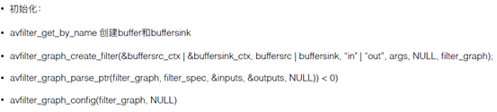

初始化部分首先要确定In的Buffer和Out的Buffersink，接下来就是创建一个滤镜的Graph，再就是做一个滤镜的解析，最后就是通用配置。


### 第二步，滤镜处理

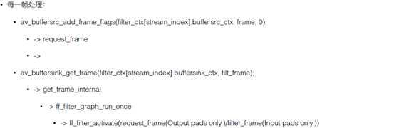

滤镜处理过程是先解码，解码之后将帧加入到Buffer，再调用滤镜处理模块，处理之后输出到Buffersink。


滤镜API的使用方法跟之前命令行的使用方法是一样的，只是略微有一点差别。如果我们不会使用多输入多输出的方式，对于API的使用实际上它的输入也可以用字符串处理的方式，就是命令行里边的处理方式


## Filter开发基础

### Module结构

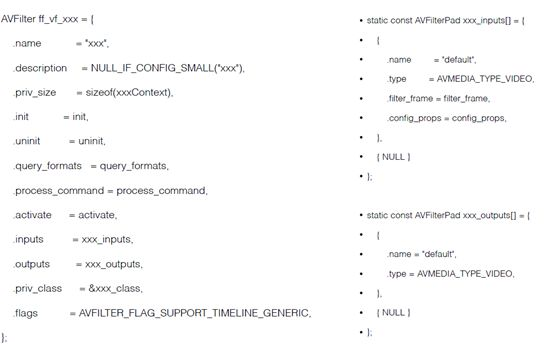


在上面的Module结构里面，可以很清晰的看出步骤流程，先要在滤镜的类里面注册它所对应的所有信息，如滤镜名，上下文等等；下一步就是对Input和Output的处理，对帧的滤镜处理正常都是在一个Input里面处理的；


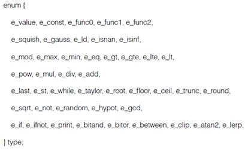

再就是要看滤镜是否支持Timeline，比如做一些动态的变量，跑马灯之类的，也要有时间线的概念。在这个里面也有一些对应的内置函数，可以把他们理解为一些数字运算的接口。以及下面还有一些变量名的定义。


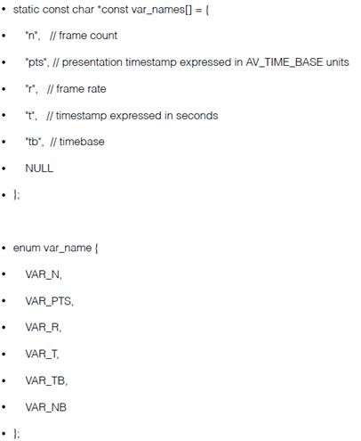


### 加入到FFmpeg中

添加滤镜的时候，主要是往下面两个里面添加：

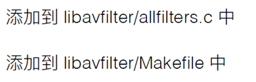

## Filter开发

<iframe height=1080 width=1920 src="./data/add-filter.mp4"/>

首先建立了一个zoomscale的滤镜文件，建立完这个文件之后，创建对应的context，然后把刚才讲到的那些接口都写进来，定义zoomscale公共的类，下面我们实现了一个filter _frame，它会把里面的input给释放掉，让它变成一个NULL，此时显示的前景图像就会变成一个纯绿色的图像，如果说这里有process commode，那么就可以在做zmq的时候用，如果没有的话，可以留空。关键是filter_frame，可以当作滤镜处理的一个入口，而get_video_buffer可以把它理解为我们看到的很多demo里面写到的get_video_buffer，即创建一个帧的对应Buffer，将其添加至Makefile之后，继续添加一个avfilter。这是FFmpeg4.0之前的版本，在后面新版本里面，采用的是数组的形式，也就没有列表那么麻烦，速度会更快一些，添加完之后，可以通过config进行查看配置，每次config完之后，会有整体的一个输出。添加完成后，进行编译，之后可以在avfilter库里直接查看滤镜是否已经加到FFmpeg的应用程序里，然后调用API部分，直接把字符串传进来就可以使用了。

