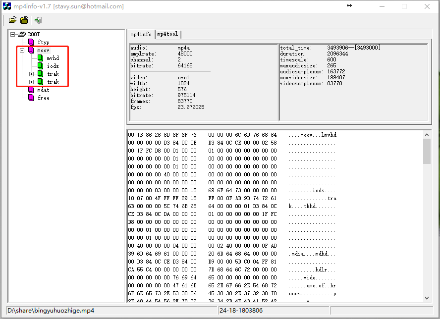
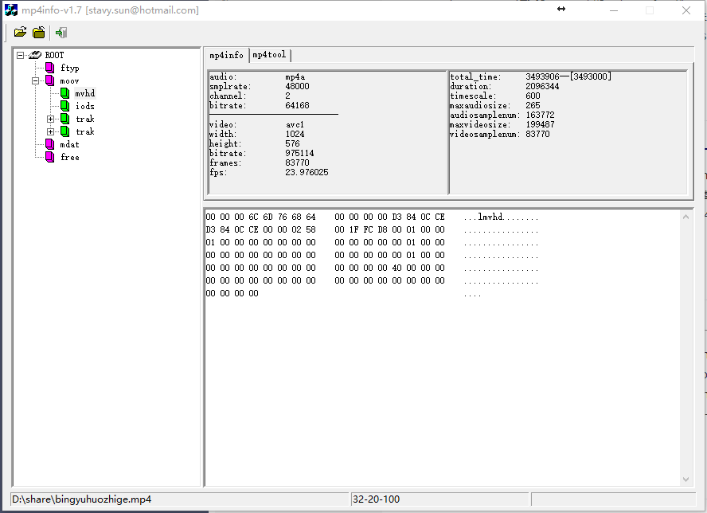
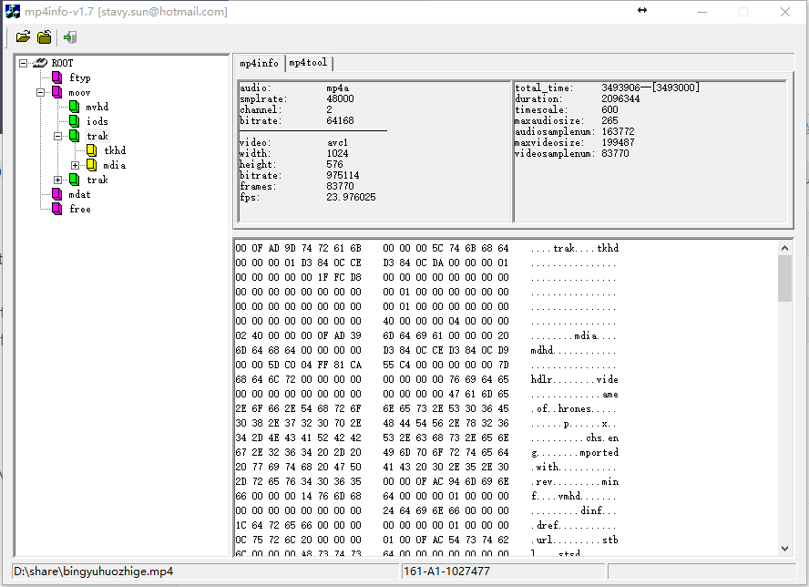
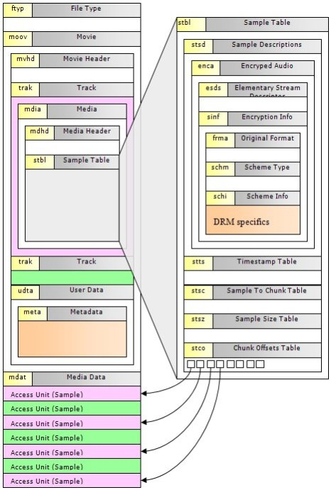
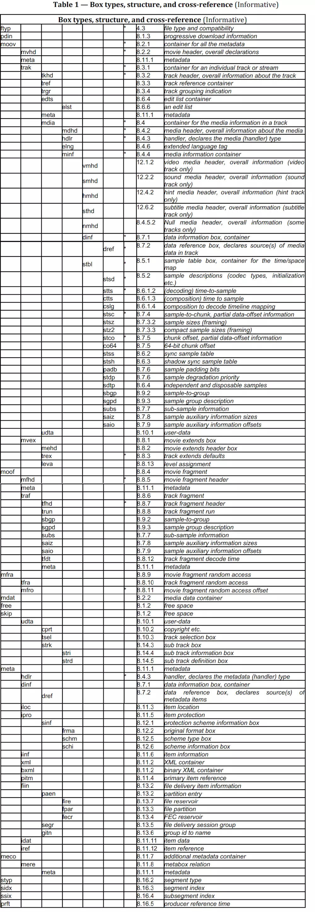

<a href="http://www.52rd.com/Blog/wqyuwss/559/">初稿来自wqyuwss的blog</a>

# Overview and Introduction

## Core Concepts

​	MP4文件格式中, 所有的内容存在一个称为movie的容器中. 一个movie可以由多个tracks组成. 每个tracks就是一个随时间变化的媒体序列, 例如, 视频帧序列. track里的每个时间单位是一个sample, 它可以是一帧视频, 或者音频. sample按照时间顺序排序. 注意, 一帧音频可以分解成多个音频sample, 所以音频一般用sample作为单位, 而不用帧. MP4文件格式的定里面, 用sample这个单词表示一个时间帧或者数据单元. 每个track会有一个或者多个sample descriptions. track里面的每个sample通过引用关联到一个sample description. 这个sample descriptions定义了怎样解码这个sample, 例如使用的压缩算法.

​	与其他的多媒体文件格式不同的是, MP4文件格式经常使用几个不同的概念, 理解其不同是理解这个文件格式的关键.

​	这个文件的物理格式没有限定媒体本身的格式. 例如, 许多文件格式将媒体数据分成帧, 头部或者其他数据紧紧跟随每帧视频, 譬如MPEG2. 而MP4文件格式不是如此.

​	文件的物理格式和媒体数据的排列都不受媒体的时间顺序限制. 视频帧不需要在文件中按时间顺序排列. 这就意味着如果文件中真的存在这样的一些帧, 那么就有一些文件结构来描述媒体的排列和对应的时间信息.

​	MP4文件中所有的数据都封装在一些box中, (以前叫atom). 所有的metadata(媒体描述元数据), 包括定义媒体的排列和时间信息的数据都包含在这样的一些结构box中. MP4文件格式定义了这些box的格式. Metadata对媒体数据(例如, 视频帧)引用说明. 媒体数据可以包含在同一个或多个box里, 也可以在其他文件中, metadata允许使用URLs来引用其他的文件, 而媒体数据在这里引用文件中的排列关系全部在第一个主文件中的metadata描述. 其他的文件不一定是MP4文件格式, 例如, 可能就没有一个box.

​	有很多种类的track, 其中有三个最重要, video track包含了视频sample, audio track包含了audio sample; hint track稍有不同, 它描述了一个流媒体服务器如何把文件中的媒体数据组成符合流媒体协议的数据包. 如果文件只是本地播放, 可以忽略hint track, 他们只与流媒体有关系.

## Physical structure of the media

​	box定义了如何在sample table中找到媒体数据的排列. 这包括data reference(数据引用), the sample size table, the sample to chunk table, and the chunk offset table. 这些表就可以找到track中每个sample在文件中的位置和大小.

​	data reference允许在第二个媒体文件中找到媒体的位置. 这样, 一步电影就可以由一个媒体数据库中的多个不同文件组成, 而且不用他们全部拷贝到另一个新文件中. 例如, 对视频编辑就很有帮助.

​	为了节约空间, 这些表都很紧凑. 另外, interleave不是sample by sample, 而是把单个track的几个samples组合到一起, 然后另外几个sample又进行新的组合, 等等. 一个track的连续几个sample组成的单元就被称为chunk. 每个chunk在文件中有一个偏移量, 这个偏移量是从文件头算起的, 在这个chunk内, sample是连续存储的.

​	这样, 如果一个chunk包含两个sample, 第二个sample的位置就是chunk的偏移量加上第一个sample的大小. chunk offset table说明了每个chunk的偏移量, sample to chunk table说明了sample序号和chunk序号的映射关系.

​	注意chunk之间可能会有死区, 没有任何媒体数据引用到这部分区域, 但是chunk内部就不会有这样的死区. 这样, 如果在节目编辑的时候, 不需要一些媒体数据, 就可以简单的留在那里, 而不用引用, 这样就不用删除它们了. 类似的, 如果媒体存放在第二个文件中, 但是格式不同于MP4文件格式, 这个陌生文件的头部或者其他文件格式都可以简单忽略掉.

## Temporal structure of the media

​	文件中的时间可以理解为一些结构. 电影以及每个track都有一个timescale. 它一定了一个时间轴来说明每秒钟有多少个ticks. 合理的选择这个数目, 就可以实现准确的计时. 一般来说, 对于audio track, 就是audio的sampling rate. 对于video track, 情况稍微复杂, 需要合理选择. 例如, 如果一个media TimeScale是30000, media sample durations是1001, 就准确的定义了NTSC video的时间格式(虽然不准确, 但一般就是29.97), and provide 19.9 hours of time in 32 bits.

​	Track的时间结构受一个edit list影响, 有两个用途: 全部电影中的一个track的一部分时间片段变化(有可能是重用); 空白时间的插入, 也就是空的edits. 特别注意的是如果一个track不是从节目开头部分开始, edit list的第一个edit就一定是空的edit.

​	每个track的全部duration定义在文件头部, 这就是对track的总结, 每个sample有一个规定的duration. 一个sample的准确描述时间, 也就是他的时间戳(time-stamp)就是以前的sample的duration之和.

## Interleave

​	文件的时间和物理结构可以是对齐的, 这表明媒体数据在容器中的物理顺序就是时间顺序. 另外, 如果多个track的媒体数据包含在同一个文件中, 这个媒体数据可以是interleaved. 一般来说, 为了方便读取一个track的媒体数据, 同时保证每个表紧凑, 以一个合适的时间间隔(例如1秒)做一个interleave, 而不是sample by sample. 这样就可以减少chunk的数据, 减小chunk offset table的大小.

## Composition

​	如果多个audio track包含在同一个文件中, 他们有可能被混合在一起进行播放, 并且由一个总track volume和左/右balance控制.

​	类似的, video track也可以根据各自的层次序列号(从后向前)和合成模式进行混合. 另外, 每个track可以用一个matrix进行变换, 也可以全部电影用一个matrix进行变换. 这样既可以进行简单操作(例如放大图像, 校正90°旋转), 也可以做更复杂的操作(例如shearing, arbitrary rotation)

​	这个混合方法只是非常简单, 是一个缺省的方法, MPEG4的另一份文档会定义更强有力的方法(例如MPEG-4 BIFS)

# Movie Atom - MOOV

​	Movie atom定义了一步电影的数据信息 它的类型是'moov', 是一个容器atom, 至少必须包含三种atom中的一种[ movie header atom('mvhd'), compressed movie atom('cmov'), reference movie atom('rmra') ]. 没有压缩的movie header atom必须至少包含movie header atom和reference movie atom中的一种. 也可以包含其他的atom, 例如一个clipping atom('clip'), 一个或者几个track atom('trak'), 一个color table atom('ctab'), 和一个user data atom('udta'). 其中movie header atom定义了整部电影的time scale, duration信息以及display characteristics. track atom定义了电影中一个track信息. Track就是电影中独立操作的媒体单位, 例如一个声道就是一个track.

​	Compressed movie atoms 和 reference movie atoms不太使用, 不讨论. 本文主要讨论uncompressed movie atoms.

## moov atom format

| 字段 | 长度(bytes) | 描述                          |
| ---- | ----------- | ----------------------------- |
| 尺寸 | 4           | 这个movie header atom的字节数 |
| 类型 | 4           | moov                          |

举例

# Movie Header Atom - MVHD

Movie header atom定义了整个movie的特性, 例如time scale和duration, 它的atom类型是'mvhd'

## mvhd atom format

| 字段               | 长度(bytes) | 描述                                                         |
| ------------------ | ----------- | ------------------------------------------------------------ |
| 尺寸               | 4           | 这个movie header atom的字节数                                |
| 类型               | 4           | mvhd                                                         |
| 版本               | 1           | 这个movie header atom的版本                                  |
| 标志               | 3           | 扩展的movie header标志, 这里为0                              |
| 生成时间           | 4           | Movie atom的起始时间, 基准时间是1904-1-1 0:00AM              |
| 修订时间           | 4           | Movie atom的修订时间, 基准时间是1904-1-1 0:00AM              |
| Time scale         | 4           | A time value that indicates the time scale for this movie -- that is, the number of time units that pass per second in its time coordinate system. A time coordinate system that measures time in sixtieths of a second, for example, has a time scale of 60 |
| Duration           | 4           | A time value that indicates the duration of the movie in time scale units. Note that this property is derived from the movie's tracks. The value of this field corresponds to the duration of the longest track in the movie. |
| 播放速度           | 4           | 播放此movie的速度, 1.0为正常播放速度                         |
| 播放音量           | 2           | 播放此movie的音量, 1.0为最大音量                             |
| 保留               | 10          | 这里为0                                                      |
| 矩阵结构           | 36          | 该矩阵定义了此movie中两个坐标空间的映射关系                  |
| 预览时间           | 4           | 以movie的time scale为单位, 预览的duration                    |
| 预览duration       | 4           | 以movie的time scale为单位, 预览的duration                    |
| Poster time        | 4           | The time value of the time of the movie poster.              |
| Selection time     | 4           | The time value for start time of the current selection.      |
| Selection duration | 4           | The duration of the current selection in movie time scale units. |
| 当前时间           | 4           | 当前时间                                                     |
| 下一个track ID     | 4           | 下一个待添加track的ID值, 0不是一个有效的ID值.                |

举例

# Track Atom - TRAK

​	一个Track atom定义了movie中的一个track. 一部movie可以包含一个或多个tracks, 它们之间相互独立, 各自有各自的时间和空间信息. 每个track atom都有与之关联的media atom

​	Track主要用于以下目的:

* 包含媒体数据引用和描述(media tracks)
* 包含modifier tracks(tweens等)
* 对于流媒体协议的打包信息(hint tracks). Hint tracks可以引用或者复制对应的媒体sample data

Hint tracks和modifier tracks必须保证完整性, 同时和至少一个media track一起存在. 换句话说, 即使hint tracks复制了对应的媒体sample data, media tracks也不能从一部hinted movie中删除.

Track atoms的atom类型是'trak'. Track atom要求必须有一个track header atom('tkhd')和一个media atom('mdia'). 其他的track clipping atom('clip'), track matte atom('matt'), edit atom('edts'), track reference atom('tref'), track load setting atom('load'), a track input map atom('imap') 以及 user data atom('udta')都是可选的

Track atoms是一个容器atom, 本身没有特别的字段, 需要子atom来进一步说明有效的内容.

## trak atom format

| 字段 | 长度(bytes) | 描述             |
| ---- | ----------- | ---------------- |
| 尺寸 | 4           | 这个atom的字节数 |
| 类型 | 4           | trak             |

举例

# Track Header Atom - TKHD

每个trak都包含了一个track header atom. The track header atom定义了一个track的特性, 例如时间, 空间和音量信息, 它的类型是('tkhd').

## tkhd atom format

| 字段            | 长度(bytes) | 描述                                                         |
| --------------- | ----------- | ------------------------------------------------------------ |
| 尺寸            | 4           | 这个atom的字节数                                             |
| 类型            | 4           | tkhd                                                         |
| 版本            | 1           | 这个atom的版本                                               |
| 标志            | 3           | 有效的标志是 * 0x0001 - the track is enabled * 0x0002 - the track is used in the movie * 0x0004 - the track is used in the movie's preview * 0x0008 - the track is used in the movie's |
| 生成时间        | 4           | Movie atom的起始时间, 基准时间是1904-1-1 0:00 AM             |
| 修订时间        | 4           | Movie atom的修订时间, 基准时间是1904-1-1 0:00 AM             |
| Track ID        | 4           | 唯一标志该track的一个非零值                                  |
| 保留            | 4           | 这里为0                                                      |
| Duration        | 4           | The duration of this track(in the movie's time coordinate system). Note that this property is derived from the track's edits. The value of this field is equal to the sum of the durations of all of the track's edits. If there is no edit list, then the duration is the sum of the sample durations, converted into the movie timescale. |
| 保留            | 8           | 这里为0                                                      |
| Layer           | 2           | The track's spatial priority in its movie. The QuickTime Movie Toolbox uses this value to determine how tracks overlay one another. Tracks with lower layer values are displayed in front of tracks with higher layer values. |
| Alternate group | 2           | A collection of movie tracks that contain alternate data for one another.  QuickTime chooses one track from the group to be used when the movie is played. The choice may be based on such considerations as playback quality, language, or the capabilities of the computer. |
| 音量            | 2           | 播放此track的音量. 1.0为正常音量                             |
| 保留            | 2           | 这里为0                                                      |
| 矩阵结构        | 36          | 该矩阵定义了此track中两个坐标空间的映射关系                  |
| 宽度            | 4           | 如果该track是video track, 此值为图像的宽度                   |
| 高度            | 4           | 如果该track是video track, 此值为图像的高度                   |

# Edit Atoms - EDTS

​	Edit atoms定义了创建movie中一个track的一部分媒体. 所有的edit都在一个表里面, 包括每一部分的时间偏移量和长度. Edit atoms的类型是'edts'. 如果没有该表, 则此track会被立即播放. 一个空的edit用来偏移track的起始时间.

​	如果没有edit atom或edit list atom, 则此track使用全部媒体.

​	Edit atoms是一个容器atom, 本地没有特别字段, 需要子atom来进一步说明有效的内容

| 字段 | 长度(bytes) | 描述             |
| ---- | ----------- | ---------------- |
| 尺寸 | 4           | 这个atom的字节数 |
| 类型 | 4           | edts             |

# Edit List Atoms - ELST

| 字段           | 长度(bytes) | 描述                                                         |
| -------------- | ----------- | ------------------------------------------------------------ |
| 尺寸           | 4           | 这个atom的字节数                                             |
| 类型           | 4           | elst                                                         |
| 版本           | 1           | 这个atom的版本                                               |
| 标志           | 3           | 这里为0                                                      |
| 条目数目       | 4           | 后面的edit list表中的条目数目                                |
| edit list表    | 可变        | 每个条目包含3项, 见下表                                      |
|                |             |                                                              |
| Track duration | 4           | duration of this edit segment in units of the movie's time scale |
| 时间           | 4           | starting time within the media of this edit segment(in media timescale units). 值为-1表示是空edit. Track中的最后一个edit永远不能为空. Any difference between the movie's duration and the track's duration is expressed as an implicit empty edit. |
| 速度           | 4           | relative rate at which to play the media corresponding to this edit segment.不能是0或负数 |

# Track Reference Atoms - TREF

​	Track reference atoms define relationships between tracks. Track reference atoms allow one track to specify how it is related to other tracks. For example, if a movie has three video tracks and three sound tracks, track references allow you to identify the related sound and video tracks. Track reference atoms have an atom type value of 'tref'.

​	Track references are uni-directional and point from the recipient track to the source track. For example, a video track may reference a time code track to indicate where its time code is stored, but the time code track would not reference the video track. The time code track is the source of time information for the video track.

​	A single track may reference multiple tracks. For exmaple, a video track could reference a sound track to indicate that the two are synchronized and a time code track to indicate where its time code is stored.

​	A single track may also be referenced by multiple tracks. For example, both a sound and video track could reference the same time code track if the share the same timing information.

​	If this atom is not present, the track is not referencing any other track in any way. Note that the array of track reference type atoms is sized to fill the track reference atom. Track references with a reference index of 0 are permitted. This indicates no reference.

​	Each track reference atom defines relationships with tracks of a specific type. The reference type implies a track type. Following table shows the track reference types and their descriptions.

Table: Track reference types

| Reference type | Description                                                  |
| -------------- | ------------------------------------------------------------ |
| tmcd           | Time code. Usually references a time code track.             |
| chap           | Chapter or scene list. Usually references a text tracck.     |
| sync           | Synchronization. Usually between a video and sound track. Indicates that the two tracks are synchronized. The reference can be from either track to the other, or there may be two references. |
| scpt           | Transcript. Usually references a text track.                 |
| ssrc           | Nonprimary source. Indicates that the referenced track should send its data to this track, rather than presenting it. The referencing track will use the data to modify how it presents its data. See "Track Input map Atoms"(page 51) for more information |
| hint           | The referenced tracks contain the original media for this hint track. |

Each track reference type atom contains the following data elements.

Size

A 32-bit integer that specifies the number of bytes in this track reference type atom.

Type

A 32-bit integer that specifies the atom type; this field must be set to one of the values shown in  above table.

Track IDs

A list of track ID values(32-bit integers) specifying the related tracks. Note that this is one case where track ID values can be set to 0. Unused entries in the atom may have a track ID value of 0. Setting the track ID to 0 may be more convenient than deleting the reference.

You can determine the number of track references stored in a track reference type atom by subtracting its header size from its overall size and the dividing by the size, in bytes, of a track ID.

# Media Atoms - MDIA

​	Media atoms定义了track的媒体类型和sample数据, 例如音频或视频, 描述sample数据的media handler component, media a timescale and track duration以及media-and-track-specific信息, 例如音量和图形模式. 它可以包含一个引用, 指明媒体数据存储在另一个文件中. 也可以包含一个sample table atoms, 指明sample descriptions, duration, and byte offset from the data reference for each media sample.

​	Media atom的类型是'mdia', 它是一个容器atom, 必须包含一个media header atom('mdhd'), 一个handler reference('hdlr'), 一个媒体信息引用('minf')和用户数据atom('udta')

| 字段 | 长度(bytes) | 描述             |
| ---- | ----------- | ---------------- |
| 尺寸 | 4           | 这个atom的字节数 |
| 类型 | 4           | mdia             |

# Media Header Atoms - MDHD

Media header atom定义了媒体的特性, 例如time scale和duration, 它的类型是'mdhd'

| 字段       | 长度(bytes) | 描述                                                         |
| ---------- | ----------- | ------------------------------------------------------------ |
| 尺寸       | 4           | 这个atom的字节数                                             |
| 类型       | 4           | mdhd                                                         |
| 版本       | 1           | 这个atom的版本                                               |
| 标志       | 3           | 这里为0                                                      |
| 生成时间   | 4           | Movie atom 的起始时间. 基准时间是1904-1-1 0:00AM             |
| 修订时间   | 4           | Movie atom 的修订时间. 基准时间是1904-1-1 0:00AM             |
| Time scale | 4           | A time value that indicates the time scale for this media -- that is, the number of time units that pass per second in its time coordinate system. |
| Duration   | 4           | The duration of this media in units of its time scale.       |
| 语言       | 2           | 媒体的语言码                                                 |
| 质量       | 2           | 媒体的回访质量? 怎样生成此质量, 什么是参照点                 |

# Handler Reference Atoms - HDLR

​	Handler reference atom定义了描述此媒体数据的media handler component, 类型是'hdlr'. 在过去, handler reference atom也可以用来数据引用, 但是现在, 已经不允许这样使用了. 一个media atom内的handler atom解释了媒体流的播放过程. 例如, 一个视频handler处理一个video track.

| 字段                   | 长度(bytes) | 描述                                                         |
| ---------------------- | ----------- | ------------------------------------------------------------ |
| 尺寸                   | 4           | 这个atom的字节数                                             |
| 类型                   | 4           | hdlr                                                         |
| 版本                   | 1           | 这个atom的版本                                               |
| 标志                   | 3           | 这里为0                                                      |
| Component type         | 4           | handler的类型, 当前只有两种类型 * 'mhlr': media handlers * 'dhlr': data handlers |
| Component subtype      | 4           | media handler or data handler的类型 * 如果component type是'mhlr', 这个字段定义了数据的类型, 例如, 'vide'是video数据, 'soun'是sound数据 * 如果component type是'dhlr', 这个字段定义了数据引用的类型, 例如, 'alis'是文件的别名 |
| Component manufacturer | 4           | 保留字段, 缺省为0                                            |
| Component flags        | 4           | 保留字段, 缺省为0                                            |
| Component flags mask   | 4           | 保留字段, 缺省为0                                            |
| Component name         | 可变        | 这个component的名字, 也就是生成此media的media handler. 该字段的长度可以为0 |

# Media Information Atoms - MINF

​	Media information atom的类型是'minf', 存储了解释该track的媒体数据的handler-specific的信息. media handler用这些信息将媒体时间映射到媒体数据, 并进行处理. 它是一个容器atom, 包含其他的子atom.

​	这些信息是与媒体定义的数据类型特别对应的, 而且media information atoms的格式和内容也是与解释此媒体数据流的media handler密切相关的. 其他的media handler不知道如何解释这些信息.

| 字段 | 长度(bytes) | 描述             |
| ---- | ----------- | ---------------- |
| 尺寸 | 4           | 这个atom的字节数 |
| 类型 | 4           | minf             |

# Video Media Information Atoms

Video media information atoms是视频媒体的第一层atoms, 包含其他的定义视频媒体数据的特性

# Sound Media Information Atoms

Sound media information atoms是音频媒体的第一层atoms, 包含其他的定义音频媒体数据的特性

# Video Media Information Header Atoms

| 字段     | 长度(bytes) | 描述                                                         |
| -------- | ----------- | ------------------------------------------------------------ |
| 尺寸     | 4           | 这个atom的字节数                                             |
| 类型     | 4           | vmhd                                                         |
| 版本     | 1           | 这个atom的版本                                               |
| 标志     | 3           | 这里总是0x000001                                             |
| 图形模式 | 2           | The transfer mode. The transfer mode specifies which Boolean operation QuickDraw should perform when drawing or transferring an image from one location to another |
| Opcolor  | 6           | Three 16-bit values that specify the red, green, and blue colors for the transfer mode operation indication in the graphics mode field. |

# Sound Media Information Header Atoms - SMHD

The sound media information header atom定义了声音媒体的控制信息, 例如均衡

| 字段 | 长度(bytes) | 描述                                                         |
| ---- | ----------- | ------------------------------------------------------------ |
| 尺寸 | 4           | 这个atom的字节数                                             |
| 类型 | 4           | smhd                                                         |
| 版本 | 1           | 这个atom的版本                                               |
| 标志 | 3           | 这里为0                                                      |
| 均衡 | 2           | 音频的均衡是用来控制计算机的两个扬声器的声音混合效果, 一般是0. |
| 保留 | 2           | 保留字段, 缺省为0                                            |

# Data Information Atoms - DINF

handler reference定义data handler component如何获取媒体数据, data handler用这些数据信息来解释媒体数据. Data Information atoms的类型是'dinf', 它是一个容器atom, 包含其他的子atom

# Data Reference Atoms - DREF

Data Reference atoms包含列表数据, data handler component可以用这些数据获取媒体数据

| 字段            | 长度(bytes) | 描述                                                         |
| --------------- | ----------- | ------------------------------------------------------------ |
| 尺寸            | 4           | 这个atom的字节数                                             |
| 类型            | 4           | dref                                                         |
| 版本            | 1           | 这个atom的版本                                               |
| 标志            | 3           | 这里为0                                                      |
| 条目数目        | 4           | data references的数目(data references的定义如下)             |
| Data references |             | 每个data reference就像atom的格式一样, 包含以下的数据成员     |
| 尺寸            | 4           | 这个atom的字节数                                             |
| 类型            | 4           | 见下表                                                       |
| 版本            | 1           | 这个data reference的版本                                     |
| 标志            | 3           | 目前只有一个标志 Self reference This flag indicates that the media's data in the same file as the movie atom. On the Macintosh, and other file systems with multifork files, set this flag to 1 even if the data resides in a different fork from the movie atom. This flag's value is 0x0001. |
| 数据            | 可变        | data reference信息                                           |

Following Table shows the currently defined data reference types that may be stored in a header atom.

表: Data reference类型

| 类型 | 描述                                                         |
| ---- | ------------------------------------------------------------ |
| alis | Data reference是一个Macintosh alias. 一个alias包含文件信息, 例如全路径名 |
| rsrc | Data reference是一个Macintosh alias. alias末尾是文件使用的资源类型(32bit整数)和ID(16bit带符号的整数) |
| url  | 一个C类型的字符串, 表示一个URL. 字符串后可以有其他的数据     |

## Sample Atoms

​	存储媒体数据的单位是samples. 一个samples是一系列按时间顺序排列的数据的一个element. Samples存储在media中的chunk内, 可以有不用的durations. Chunk存储一个或者多个samples, 是数据存取的基本单位, 可以有不同的长度, 一个chunk内的每个sample也可以有不同的长度. 

​	sample table atom描述sample的所有信息以及一些不同类型的atoms, media handler可以用这些信息正确的按顺序解析所有的samples, 而不需要强迫这些数据按movie的时间顺序存放到实际数据流中.

* 如何得到chunk的数目和每个chunk包含多少个sample, 每个chunk的description是如何.

解析stsc Sample-to-Chunk table. 这个表类似于行程编码, 第一个frist chunk减去第二个first chunk就是一共有多少个trunk包含相同的sample数目, 这样通过不断的叠加, 就可以得到一共有280个trunk, 每个trunk包含多少个sample, 以及每个trunk对应的description

* 如何计算每个sample的duration

* 如何计算每个sample的长度

解析stsz - Simple Size table. 这个表包含了每个sample的长度, 找到sample的序号, 就可以找到对应sample的长度了.

# Sample Table Atoms - STBL

​	sample table atom包含转化媒体时间到实际sample的信息, 他也说明了解释sample的信息. 例如, 视频数据是否需要解压缩, 解压缩算法是什么? 它的类型是'stbl', 是一个容器atom, 包含sample description atom, time-to-sample atom, sync sample atom, sample-to-chunk atom, sample size atom, chunk offset atom和shadow sync atom.

​	sample table atom包含track中media sample的所有时间和数据索引, 利用这个表, 就可以定位sample到媒体时间, 决定其类型, 大小, 以及如何在其他容器中找到紧邻的sample.

​	如果sample table atom所在的track引用了数据, 那么必须包含以下的子atom: sample description, sample size, sample to chunk和chunk offset. 所有的子表有相同的sample数目.

​	sample description atom是必不可少的一个atom, 而且必须包含至少一个条目, 因为它包含了数据引用atom检索media sample的目录信息, 没有sample description. 就不可能计算出media sample存储的位置. sync sample atom是可选的, 如果没有, 表明所有的samples都是sync samples.

# Sample Description Atoms - STSD

​	利用sample description atom存储的信息可以正确的解码media sample. 不同的媒体类型存储不同的sample description, 例如, 视频媒体, sample description就是图像的结构. 

​	sample description atom的类型是'stsd', 包含了一个sample description表. 根据不同的编码方案和存储数据的文件数目, 每个media可以有一个到多个sample description. sample-to-chunk atom通过这个索引表, 找到合适media中每个sample的description

| 字段               | 长度(bytes) | 描述                                                         |
| ------------------ | ----------- | ------------------------------------------------------------ |
| 尺寸               | 4           | 这个atom的字节数                                             |
| 类型               | 4           | stsd                                                         |
| 版本               | 1           | 这个atom的版本                                               |
| 标志               | 3           | 这里为0                                                      |
| 条目数目           | 4           | sample description的数目                                     |
| sample description |             | 不同的媒体类型有不同的sample description, 但是每个sample description的前四个字段是相同的, 包含以下的数据成员 |
| 尺寸               | 4           | 这个sample description的字节数                               |
| 数据格式           | 4           | 存储数据的格式                                               |
| 保留               | 6           |                                                              |
| 数据引用索引       | 2           | 利用这个索引可以检索与当前sample description关联的数据, 数据引用存储在data reference atoms |

# Time to sample Atoms - STTS

​	Time-to-sample atoms存储了media sample的duration信息, 提供了时间对具体data sample的映射方法, 通过这个atom, 你可以找到任何时间的sample, 类型是'stts'

这个atom可以包含一个压缩的表来映射时间和sample序号, 用其他的表来提供每个sample的长度和指针. 表中每个条目提供了同一个时间偏移量里边连续的sample序号, 以及samples的偏移量. 递增这些偏移量, 就可以建立一个完整的time-to-sample表: 计算公式如下:

​	DT(n + 1) = DT(n) + STTS(n)

​	其中STTS(n)是没有压缩的STTS第n项信息, DT是第n个sample的显示时间, Sample的排列是按照时间戳的顺序, 这样偏移量永远是非负的. DT一般以0开始, 如果不为0, edit list atom设定初始的DT值. DT计算公式如下

​	DT(i) = SUM(for j = 0 to i - 1 of delta(j))

所有偏移量的和就是track中media的长度, 这个长度不包括media的time scale, 也不包括任何edit list

| 字段            | 长度(字节) | 描述                                      |
| --------------- | ---------- | ----------------------------------------- |
| 尺寸            | 4          | 这个atom的字节数                          |
| 类型            | 4          | stts                                      |
| 版本            | 1          | 这个atom的版本                            |
| 标志            | 3          | 这里为0                                   |
| 条目数目        | 4          | time-to-sample的数目                      |
| time-to-sample  |            | Media中每个sample的duration, 包含如下结构 |
| sample count    | 4          | 有相同duration的连续sample数目            |
| sample duration | 4          | 每个sample的duration                      |

​	如果多个sample有相同的duration, 可以只用一项描述所有这些samples, 数量字段说明sample的个数. 例如, 如果一个视频媒体的帧率保持不变, 整个表可以只有一项, 数量就是全部的帧数.

# Sync Sample Atoms - STSS

​	sync sample atom确定media中的关键帧. 对于压缩的媒体, 关键帧是一系列压缩序列的开始帧, 它的解压缩是不依赖于以前的帧. 后续帧的解压缩依赖于这个关键帧.

​	sync sample atom可以非常紧凑的标记媒体内的随机存取点. 它包含一个sample序号表, 表内的每一项严格按照sample的序号排序, 说明了媒体中的哪一个sample是关键帧. 如果此表不存在, 说明每一个sample都是一个关键帧, 是一个随机存取点.

| 字段        | 长度(bytes) | 描述                 |
| ----------- | ----------- | -------------------- |
| 尺寸        | 4           | 这个atom的字节数     |
| 类型        | 4           | stss                 |
| 版本        | 1           | 这个atom的版本       |
| 标志        | 3           | 这里为0              |
| 条目数目    | 4           | sync sample的数目    |
| sync sample |             | sync sample表的结构  |
| sample序号  | 4           | 是关键帧的sample序号 |

# Sample to Chunk Atoms - STSC

​	当添加samples到media时, 用chunks组织这些sample, 这样可以方便优化数据获取. 一个trunk包含一个或多个sample, chunk的长度可以不同, chunk内的sample的长度也可以不同. sample-to-chunk atom存储sample与chunk的映射关系

​	Sample-to-chunk atoms的类型是'stsc', 它也有一个表来映射sample和trunk之间的关系, 查看这张表, 就可以找到包含指定sample的trunk, 从而找到这个sample.

| 字段                  | 长度(bytes) | 描述                                       |
| --------------------- | ----------- | ------------------------------------------ |
| 尺寸                  | 4           | 这个atom的字节数                           |
| 类型                  | 4           | stsc                                       |
| 版本                  | 1           | 这个atom的版本                             |
| 标志                  | 3           | 这里为0                                    |
| 条目数目              | 4           | sample-to-chunk的数目                      |
| sample-to-chunk       |             | sample-to-chunk表的结构                    |
| First chunk           | 4           | 这个table使用的第一个chunk序号             |
| sample per chunk      | 4           | 当前trunk内的sample数目                    |
| sample description ID | 4           | 与这些sample关联的sample description的序号 |

可以建立Video track的sample-to-chunk表

| First chunk | Samples per chunk | Sample description ID |
| ----------- | ----------------- | --------------------- |
| 1           | 4                 | 1                     |
| 4           | 3                 | 1                     |
| 5           | 4                 | 1                     |
| 8           | 3                 | 1                     |
| 9           | 4                 | 1                     |
| 12          | 3                 | 1                     |
| 13          | 4                 | 1                     |
| 16          | 3                 | 1                     |
| 17          | 4                 | 1                     |
| 20          | 3                 | 1                     |
| 21          | 4                 | 1                     |
| ...         | ...               | ...                   |
| 277         | 4                 | 1                     |
| 280         | 3                 | 1                     |

这个表类似于行程编码, 第一个first chunk减去第二个first chunk就是一共有多少个trunk包含相同的sample数目, 这样通过不断的叠加, 就可以得到一共有280个trunk, 每个trunk包含多少个sample, 以及每个trunk对应的description

# Sample Size Atoms - STSZ

​	sample size atoms定义了每个sample的大小, 它的类型是'stsz', 包含了媒体中全部sample的数目和一张给出每个sample大小的表. 这样, 媒体数据自身就可以没有边框的限制.

| 字段        | 长度(bytes) | 描述                                                         |
| ----------- | ----------- | ------------------------------------------------------------ |
| 尺寸        | 4           | 这个atom的字节数                                             |
| 类型        | 4           | stsz                                                         |
| 版本        | 1           | 这个atom的版本                                               |
| 标志        | 4           | 这里为0                                                      |
| sample size | 4           | 全部sample的数目. 如果所有的sample有相同的长度, 这个字段就是这个值, 否则, 这个字段的值是0. 那些长度存在sample size表中 |
| 条目数目    | 4           | sample size的数目                                            |
| sample size |             | sample size表的结构, 这个表根据sample number索引, 第一项就是第一个sample, 第二项就是第二个sample |
| 大小        | 4           | 每个sample的大小                                             |

# Chunk Offset Atoms - STCO

​	chunk offset atoms定义了每个trunk在媒体流中的位置, 它的类型是'stco'. 位置有两种可能, 32位和64位的, 后者对非常大的电影很有用. 在一个表中只会有一种可能, 这个位置是整个文件中的, 而不是在任何atom中的, 这样做就可以直接在文件中找到媒体数据, 而不用解释atom. 需要注意的是一旦前面的atom有了任何改变, 这张表都要重新建立, 因为位置信息已经改变了.

| 字段         | 长度(bytes) | 描述                                                         |
| ------------ | ----------- | ------------------------------------------------------------ |
| 尺寸         | 4           | 这个atom的字节数                                             |
| 类型         | 4           | stco                                                         |
| 版本         | 1           | 这个atom的版本                                               |
| 标志         | 3           | 这里为0                                                      |
| 条目数目     | 4           | chunk offset的数目                                           |
| chunk offset |             | 字节偏移量从文件开始到当前chunk, 这个表根据chunk number索引, 第一项就是第一个trunk, 第二项就是第二个trunk |
| 大小         | 4           | 每个sample的大小                                             |

# Diagrammatic:

# 计算电影长度

方法1:

从mvdh - movie header atom中找到time scale和duration, duration除以time scale即是整部电影的长度.

time scale相当于定义了标准的1秒在这步电影里面的刻度是多少

例如audio track的time scale = 8000, duration = 560128, 所以总长度是70.016, video track的time scale = 600, duration = 42000, 所以总长度是70

方法2:

首先计算出共有多少个帧, 也就是sample(从sample size atoms中得到) 然后整部电影的duration = 每个帧的duration之和(从Time-to-sample atoms中得出)

例如audio track共有547个sample, 每个sample的长度是1024, 则总duration是560128, 电影长度是70.016; video track共有1050个sample, 每个sample的长度是40 则总duration是42000, 电影长度是70

# 计算电影声音采样频率

从tkhd - track header atom中找出audio track的time scale即是声音的采样频率

# 计算电影图像宽度和高度

从tkhd - track header atom中找到宽度和高度即是

# 计算视频帧率

首先计算出整部电影的duration, 和帧的数目然后

帧率 = 整部电影的duration / 帧的数目

# 计算电影的比特率

整部电影的尺寸除以长度, 即是比特率, 此电影的比特率为846623 / 70 = 12094 bps

# 查找sample

​	当播放一部电影或者一个track的时候, 对应的media handler必须能够正确的解析数据流, 对一定的时间获取对应的媒体数据. 如果是视频媒体, media handler可能会解析多个atom, 才能找到给定时间的sample的大小和位置. 具体步骤如下:

1. 确定时间, 相对于媒体时间坐标系统
2. 检查time-to-sample atom来确定给定时间的sample序号
3. 检查sample-to-chunk atom来发现对应sample的chunk
4. 从chunk-offset atom中提取该chunk的偏移量
5. 利用sample-size atom找到sample在trunk内的偏移量和sample的大小

例如, 如果要找到第1秒的视频数据, 过程如下:

1. 第1秒的视频数据相对于此电影的时间为600
2. 检查time-to-sample atom, 得出每个sample的duration是40, 从而得出徐还要寻找第600/40 = 15 + 1 = 16个sample
3. 检查sample-to-chunk atom, 得到该sample属于第5个chunk的第一个sample, 该chunk共有4个sample
4. 检查chunk-offset atom找到第5个trunk的偏移量是20472
5. 由于第16个sample是第5个chunk的第一个sample, 所以不要检查sample-size atom, chunk的偏移量即是该sample的偏移量20472. 如果是这个chunk的第二个sample, 则从sample size atom中找到该trunk的前一个sample的大小, 然后加上偏移量即可得到实际位置
6. 得到位置后, 即可取出相应数据进行解码, 播放

# 查找关键帧

查找过程与查找sample的过程非常类似, 只是需要利用sync-sample atom来确定key frame的sample序号

1. 确定给定时间的sample序号
2. 检查sync-sample atom来发现这个sample序号之后的key frame
3. 检查sample-to-chunk atom来发现对应该sample的chunk
4. 从chunk-offset atom中提取chunk的偏移量
5. 利用sampe-size atom找到sample在chunk内的偏移量和sample的大小

# Seeking

Seeking主要是利用sample table box里面包含的子box来实现的，还需要考虑edit list的影响。

可以按照以下步骤seek某一个track到某个时间T，注意这个T是以movie header box里定义的time scale为单位的：

1. 如果track有一个edit list，遍历所有的edit，找到T落在哪个edit里面。将Edit的开始时间变换为以movie time scale为单位，得到EST，T减去EST，得到T'，就是在这个edit里面的duration，注意此时T'是以movie的time scale为单位的。然后将T'转化成track媒体的time scale，得到T''。T''与Edit的开始时间相加得到以track媒体的time scale为单位的时间点T'''。
2. 这个track的time-to-sample表说明了该track中每个sample对应的时间信息，利用这个表就可以得到T'''对应的sample NT。
3. sample NT可能不是一个random access point，这样就需要其他表的帮助来找到最近的random access point。一个表是sync sample表，定义哪些sample是random access point。使用这个表就可以找到指定时间点最近的sync sample。如果没有这个表，就说明所有的sample都是synchronization points，问题就变得更容易了。另一个shadow sync box可以帮助内容作者定义一些特殊的samples，它们不用在网络中传输，但是可以作为额外的random access point。这就改进了random access，同时不会影响正常的传输比特率。这个表指出了非random access point和random access point之间的关系。如果要寻找指定sample之前最近的shadow sync sample，就需要查询这个表。总之，利用sync sample和shadow sync表，就可以seek到NT之前的最近的access point sample Nap。
4. 找到用于access point的sample Nap之后，利用sample-to-chunk表来确定sample位于哪个chunk内。
5. 找到chunk后，使用chunk offset找到这个chunk的开始位置。
6. 使用sample-to-chunk表和sample size表中的数据，找到Nap在此chunk内的位置，再加上此chunk的开始位置，就找到了Nap在文件中的位置。

例如，我们需要seek到30s。
需要做如下工作：

1. 使用timescale将目标时间标准化。timescale为90000，30*90000=2700000。
2. 通过time-to-sample box找到指定track的给定时间之前的第一个sample number。2700000/3000 = 900。
3. 通过sync sample table查询sample number之前的第一个sync sample。对应为795的sample。
4. 通过sample-to-chunk table查找到对应的chunk number。
    对应的chunk号是假设是400。
5. 通过chunk offset box查找到对应chunk在文件中的起始偏移量。第14个chunk的offset是3481072。
6. 最后使用sample-to-chunk box和sample size box的信息计算出该chunk中需要读取的sample数据，即完成seek。

# Reference Datas:

<a href="https://www.jianshu.com/p/529c3729f357">mp4文件格式解析</a>

